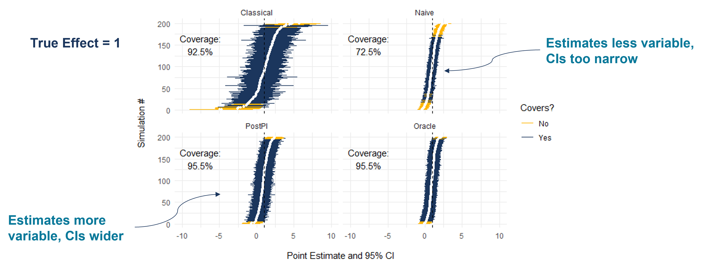
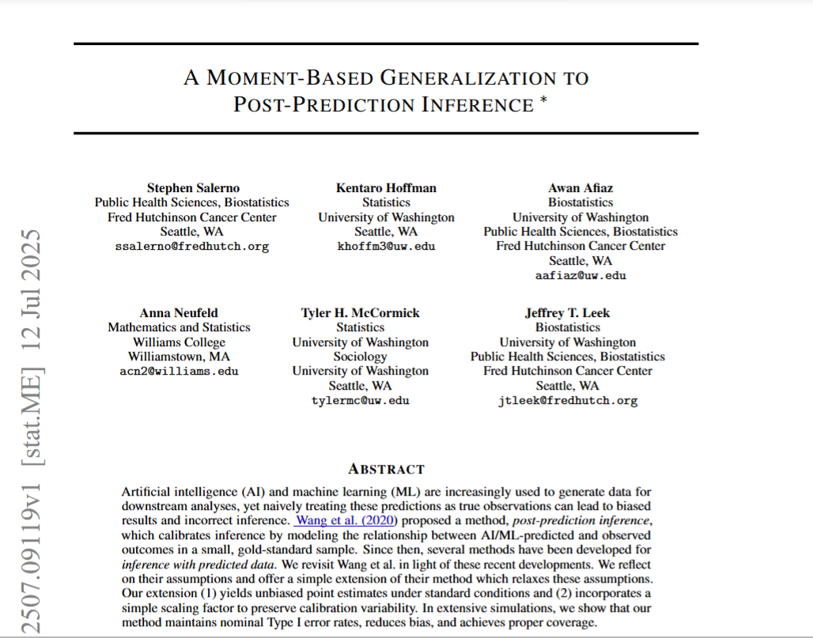
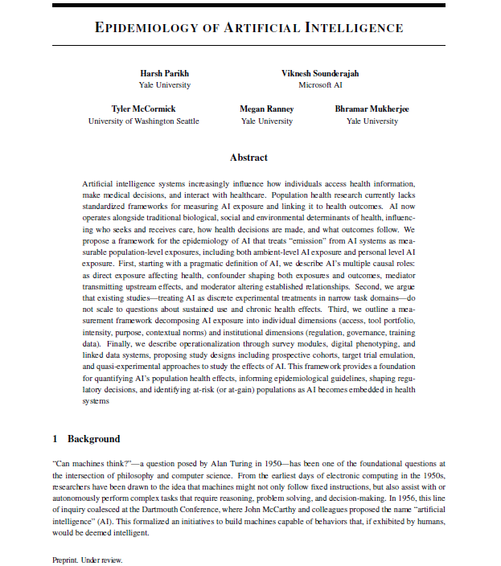
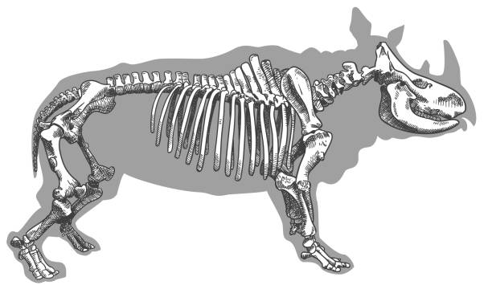

## A a link to these slides {.theme-bg3}

### If you would like to follow along on your own device

<br>

![[Slides: https://salernos.github.io/2026-washu-talking-public-health]{.caption}](images/qr_slides.png){width="35%" fig-align="center"}

## Public Health in a World Where We [*Think We*]{style="color: #00C1D5;"} Can Predict Anything {.theme-bg3}

::: kicker
Predictions are becoming *inputs* to public health science and practice. If we treat them like ordinary measurements, we can get **confident** answers to the **wrong** questions.
:::

-   Public health has always dealt with incomplete measurement
-   What is new is that AI makes predicted 'data' increasingly cheap, scalable, and pervasive
-   This work focuses on the statistical, computational, and practical infrastructure we need to do this responsibly

## A roadmap for today {.theme-bg3}

1.  How prediction is becoming part of public health 'data'
2.  Why this creates a statistical problem
3.  What we are doing to address this
4.  Where we are intervening in public health research

## In public health, the quantity we care about may be: {.theme-bg3}

\|:----------------------------------\|:--------------------------------------:\|:------\| \| Partially observed \| Medically-certified cause of death \| image \| \| Expensive to measure \| Dual-energy X-ray absorptiometry scans \| image \| \| Delayed to obtain \| NEED \| image \| \| Or never directly observed at all \| NEED \| image \|

::: fragment
So we reconstruct it from the data we can obtain.
:::

## Predictions are everywhere in public health {.theme-bg3}

### Predictions as proxy data already appear throughout modern public health research

\[what to put here\]?

## Why is this happening now? {.theme-bg3}

### For example: simultaneous revolutions in computing and biology

<br>

::::: columns
::: {.column width="50%"}
![[Source: https://www.ark-invest.com/articles/analyst-research/ai-training]{.caption}](images/revolution1.png){fig-align="center"}
:::

::: {.column width="50%"}
![[Source: https://digitalfoodlab.com/graph-week-genome-sequencing-price-going/]{.caption}](images/revolution2.png){fig-align="center"}
:::
:::::

::: {.footer font-size="0.75em !important"}
Adapted from *Post-prediction inference*. Source: jtleek.com/talks
:::

## What does this mean for how we collect data? {.theme-bg3 auto-animate="true" auto-animate-easing="ease-in-out"}

### A simple sample size calculation

::: {.r-fit-text color="#1B365D"}
$$
N = \text{Sample Size}
$$
:::

## What does this mean for how we collect data? {.theme-bg3 auto-animate="true" auto-animate-easing="ease-in-out"}

### A simple sample size calculation

::: {.r-fit-text color="#1B365D"}
$$
N = \frac{\$ \text{ You Have }}{\$ \text{ Per Sample }}
$$
:::

## Neighborhood characteristics from street view images... {.theme-bg3}

<br>

::::::: columns
:::: {.column width="60%"}
::: fragment
![[Source: https://www.pnas.org/doi/abs/10.1073/pnas.1700035114]{.caption}](images/Paper1.png){width="65%" fig-align="center"}
:::
::::

:::: {.column width="40%"}
::: fragment
"We show that socioeconomic attributes such as income, race, education, and voting patterns can be inferred from cars detected in Google Street View images using deep learning."
:::
::::
:::::::

## Malnutrition risk from remotely sensed and field data... {.theme-bg3}

<br>

::::::: columns
:::: {.column width="60%"}
::: fragment
![[Source: https://www.pnas.org/doi/10.1073/pnas.2416161122]{.caption}](images/Paper2.png){width="65%" fig-align="center"}
:::
::::

:::: {.column width="40%"}
::: fragment
"We combine supervised machine learning methods and remotely sensed feature sets with time series child anthropometric data ... to generate accurate forecasts of acute malnutrition at operationally meaningful time horizons."
:::
::::
:::::::

## Poverty from satellite images of nighttime lights... {.theme-bg3}

<br>

::::::: columns
:::: {.column width="60%"}
::: fragment
![[Source: https://www.science.org/doi/10.1126/science.aaf7894]{.caption}](images/Paper3.png){width="65%" fig-align="center"}
:::
::::

:::: {.column width="40%"}
::: fragment
"With a bit of machine-learning wizardry, the combined images can be converted into accurate estimates of household consumption and assets, both of which are hard to measure in poorer countries."
:::
::::
:::::::

## Influenza activity from search/query behavior... {.theme-bg3}

<br>

::::::: columns
:::: {.column width="60%"}
::: fragment
![[Source: https://www.nature.com/articles/nature07634]{.caption}](images/Paper4.png){width="65%" fig-align="center"}
:::
::::

:::: {.column width="40%"}
::: fragment
"Here we present a method of analysing large numbers of Google search queries to track influenza-like illness in a population."
:::
::::
:::::::

## Our core framing {.theme-bg3}

### Prediction is becoming part of data collection

In many public health settings, we have:

-   An outcome we really care about
-   Cheaper or more scalable predictors
-   An algorithm that maps these predictors to a prediction of the outcome

::: fragment
That prediction is often then used as if it were data.
:::

# Two concrete examples from my work {.theme-bg2}

## I will exemplify the statistical framing with two very different examples {.theme-bg3}

### In reality, we can find examples in any field and everywhere in between

<br>

::::: columns
::: {.column width="50%"}
**Complex Predictions: Cause of Death from Verbal Autopsies**
:::

::: {.column width="50%"}
**Simple Predictions: BMI as a Proxy for Adiposity**
:::
:::::

## Good predictions are useful. But prediction is not measurement. {.theme-bg3}

### That distinction matters when our goal is not just predictive accuracy, but:

-   Estimation
-   Uncertainty quantification
-   Regression
-   Hypothesis testing
-   Population-level inference

## A common data structure {.theme-bg3 auto-animate="true" auto-animate-easing="ease-in-out"}

### We are interested in studying the association between an outcome ($Y$) and covariates ($X$)

In our VA work, $Y$ is cause of death and $X$ are sociodemographic factors like age or country of origin

In our BMI work, $Y$ is true adiposity (% body fat) and $X$ are demographic factors like age or sex

<br>

::::: r-hstack
::: {.data-label .label-yf data-id="ytext"}
Y
:::

::: {.data-label .label-xz data-id="xtext"}
X
:::
:::::

::::: r-hstack
::: {.data-label .label-yf data-id="ytext"}
True COD
:::

::: {.data-label .label-xz data-id="xtext"}
Age, Country of Origin
:::
:::::

::::: r-hstack
::: {.data-label .label-yf data-id="ytext"}
\% Body Fat
:::

::: {.data-label .label-xz data-id="xtext"}
Age, Sex
:::
:::::

::::: r-hstack
::: {.data-box .box-yl data-id="yl"}
:::

::: {.data-box .box-xl data-id="xl"}
:::
:::::

## A common data structure {.theme-bg3 auto-animate="true" auto-animate-easing="ease-in-out"}

### We also have data ($Z$) that are predictive of our outcome

In our VA work, $Z$ are our structure VA questionnaires and narrative summaries

In our BMI work, $Z$ are anthropometric measurements (height and weight)

<br>

:::::: r-hstack
::: {.data-label .label-yf data-id="ytext"}
Y
:::

::: {.data-label .label-xz data-id="xtext"}
X
:::

::: {.data-label .label-xz data-id="ztext"}
Z
:::
::::::

:::::: r-hstack
::: {.data-label .label-yf data-id="ytext"}
True COD
:::

::: {.data-label .label-xz data-id="xtext"}
Age, Country of Origin
:::

::: {.data-label .label-xz data-id="ztext"}
VA Questionnaire
:::
::::::

:::::: r-hstack
::: {.data-label .label-yf data-id="ytext"}
\% Body Fat
:::

::: {.data-label .label-xz data-id="xtext"}
Age, Sex
:::

::: {.data-label .label-xz data-id="ztext"}
Height, Weight
:::
::::::

:::::: r-hstack
::: {.data-box .box-yl data-id="yl"}
:::

::: {.data-box .box-xl data-id="xl"}
:::

::: {.data-box .box-zl data-id="zl"}
:::
::::::

## In many cases, unlabeled features ($X,Z$) are cheap and easy to collect {.theme-bg3 auto-animate="true" auto-animate-easing="ease-in-out"}

### Our outcome of interest, however, can be time-consuming or costly to obtain

<br>

:::::: r-hstack
::: {.data-label .label-yf data-id="ytext"}
Y
:::

::: {.data-label .label-xz data-id="xtext"}
X
:::

::: {.data-label .label-xz data-id="ztext"}
Z
:::
::::::

:::::: r-hstack
::: {.data-label .label-yf data-id="ytext"}
True COD
:::

::: {.data-label .label-xz data-id="xtext"}
Age, Country of Origin
:::

::: {.data-label .label-xz data-id="ztext"}
VA Questionnaire
:::
::::::

:::::: r-hstack
::: {.data-label .label-yf data-id="ytext"}
\% Body Fat
:::

::: {.data-label .label-xz data-id="xtext"}
Age, Sex
:::

::: {.data-label .label-xz data-id="ztext"}
Height, Weight
:::
::::::

:::::: r-hstack
::: {.data-box .box-yl data-id="yl"}
:::

::: {.data-box .box-xl data-id="xl"}
:::

::: {.data-box .box-zl data-id="zl"}
:::
::::::

:::::: r-hstack
::: {.data-box .box-yu data-id="yu"}
:::

::: {.data-box .box-xu data-id="xu"}
:::

::: {.data-box .box-zu data-id="zu"}
:::
::::::

## Modern studies use accessible data and an algorithm to predict these outcomes {.theme-bg3 auto-animate="true" auto-animate-easing="ease-in-out"}

### These predictions are then treated as measured data and used in downstream analyses or for policy making

<br>

::::::: r-hstack
::: {.data-label .label-yf data-id="ytext"}
Y
:::

::: {.data-label .label-yf data-id="ftext"}
f
:::

::: {.data-label .label-xz data-id="xtext"}
X
:::

::: {.data-label .label-xz data-id="ztext"}
Z
:::
:::::::

::::::: r-hstack
::: {.data-label .label-yf data-id="ytext"}
True COD
:::

::: {.data-label .label-yf data-id="ftext"}
VA COD
:::

::: {.data-label .label-xz data-id="xtext"}
Age, Country of Origin
:::

::: {.data-label .label-xz data-id="ztext"}
VA Questionnaire
:::
:::::::

::::::: r-hstack
::: {.data-label .label-yf data-id="ytext"}
\% Body Fat
:::

::: {.data-label .label-yf data-id="ftext"}
BMI
:::

::: {.data-label .label-xz data-id="xtext"}
Age, Sex
:::

::: {.data-label .label-xz data-id="ztext"}
Height, Weight
:::
:::::::

::::::: r-hstack
::: {.data-box .box-yl data-id="yl"}
:::

::: {.data-box .box-fl data-id="fl"}
:::

::: {.data-box .box-xl data-id="xl"}
:::

::: {.data-box .box-zl data-id="zl"}
:::
:::::::

::::::: r-hstack
::: {.data-box .box-yu data-id="yu"}
:::

::: {.data-box .box-fu data-id="fu"}
:::

::: {.data-box .box-xu data-id="xu"}
:::

::: {.data-box .box-zu data-id="zu"}
:::
:::::::

## 

::: kicker
So what are our options?
:::

## Option 1: Classical Inference {.theme-bg3 auto-animate="true" auto-animate-easing="ease-in-out"}

### Estimate our statistic of interest with only the observations that have measured outcomes

Parameter of interest is [$\beta$]{style="color: #AA4AC4;"}, the population-level regression coefficients of [$Y$]{style="color: #AA4AC4;"} on [$X$]{style="color: #1B365D;"}

<br>

::::::: r-hstack
::: {.data-label .label-yf data-id="ytext"}
Y
:::

::: {.data-label .label-yf data-id="ftext"}
f
:::

::: {.data-label .label-xz data-id="xtext"}
X
:::

::: {.data-label .label-xz data-id="ztext"}
Z
:::
:::::::

::::::: r-hstack
::: {.data-label .label-yf data-id="ytext"}
True COD
:::

::: {.data-label .label-yf data-id="ftext"}
VA COD
:::

::: {.data-label .label-xz data-id="xtext"}
Age, Country of Origin
:::

::: {.data-label .label-xz data-id="ztext"}
VA Questionnaire
:::
:::::::

::::::: r-hstack
::: {.data-label .label-yf data-id="ytext"}
\% Body Fat
:::

::: {.data-label .label-yf data-id="ftext"}
BMI
:::

::: {.data-label .label-xz data-id="xtext"}
Age, Sex
:::

::: {.data-label .label-xz data-id="ztext"}
Height, Weight
:::
:::::::

::::::: r-hstack
::: {.data-box .box-yl data-id="yl"}
:::

::: {.data-box .box-fl data-id="fl"}
:::

::: {.data-box .box-xl data-id="xl"}
:::

::: {.data-box .box-zl data-id="zl"}
:::
:::::::

::::::: r-hstack
::: {.data-box .box-yu data-id="yu"}
:::

::: {.data-box .box-fu data-id="fu"}
:::

::: {.data-box .box-xu data-id="xu"}
:::

::: {.data-box .box-zu data-id="zu"}
:::
:::::::

## Option 1: Classical Inference {.theme-bg3 auto-animate="true" auto-animate-easing="ease-in-out"}

### Estimate our statistic of interest with only the observations that have measured outcomes

Parameter of interest is [$\beta$]{style="color: #AA4AC4;"}, the population-level regression coefficients of [$Y$]{style="color: #AA4AC4;"} on [$X$]{style="color: #1B365D;"}

<br>

::::::::::::::::::::: columns
::::::::::::::: {.column width="50%"}
::::: r-hstack
::: {.data-label .label-yf data-id="ytext"}
Y
:::

::: {.data-label .label-xz data-id="xtext"}
X
:::
:::::

::::: r-hstack
::: {.data-label .label-yf data-id="ytext"}
True COD
:::

::: {.data-label .label-xz data-id="xtext"}
Age, Country of Origin
:::
:::::

::::: r-hstack
::: {.data-label .label-yf data-id="ytext"}
\% Body Fat
:::

::: {.data-label .label-xz data-id="xtext"}
Age, Sex
:::
:::::

::::: r-hstack
::: {.data-box .box-yl data-id="yl"}
:::

::: {.data-box .box-xl data-id="xl"}
:::
:::::

$$
{\Huge \underbrace{\hspace{5cm}}_{\color{#AA4AC4}{\hat{\beta}_{\text{lab}}}}}
$$
:::::::::::::::

::::::: {.column width="50%"}
**Advantages:**

-   Targets the right scientific quantity
-   Low bias if the labeled set is representative

**Problems:**

-   Throws away information on many observations
-   Potential to miss important signals

<br>

:::::: fragment
::::: bottom-metrics
::: {.metric-box .metric-green data-id="bias"}
Low Bias
:::

::: {.metric-box .metric-red data-id="precision"}
High Variance
:::
:::::
::::::
:::::::
:::::::::::::::::::::

## Option 2: Naive Inference {.theme-bg3 auto-animate="true" auto-animate-easing="ease-in-out"}

### Treat the predicted outcomes as if they were measured and use all observations

Parameter of interest is [$\gamma$]{style="color: #00C1D5;"}, the population-level regression coefficients of [$f$]{style="color: #00C1D5;"} on [$X$]{style="color: #1B365D;"}

<br>

::::::: r-hstack
::: {.data-label .label-yf data-id="ytext"}
Y
:::

::: {.data-label .label-yf data-id="ftext"}
f
:::

::: {.data-label .label-xz data-id="xtext"}
X
:::

::: {.data-label .label-xz data-id="ztext"}
Z
:::
:::::::

::::::: r-hstack
::: {.data-label .label-yf data-id="ytext"}
True COD
:::

::: {.data-label .label-yf data-id="ftext"}
VA COD
:::

::: {.data-label .label-xz data-id="xtext"}
Age, Country of Origin
:::

::: {.data-label .label-xz data-id="ztext"}
VA Questionnaire
:::
:::::::

::::::: r-hstack
::: {.data-label .label-yf data-id="ytext"}
\% Body Fat
:::

::: {.data-label .label-yf data-id="ftext"}
BMI
:::

::: {.data-label .label-xz data-id="xtext"}
Age, Sex
:::

::: {.data-label .label-xz data-id="ztext"}
Height, Weight
:::
:::::::

::::::: r-hstack
::: {.data-box .box-yl data-id="yl"}
:::

::: {.data-box .box-fl data-id="fl"}
:::

::: {.data-box .box-xl data-id="xl"}
:::

::: {.data-box .box-zl data-id="zl"}
:::
:::::::

::::::: r-hstack
::: {.data-box .box-yu data-id="yu"}
:::

::: {.data-box .box-fu data-id="fu"}
:::

::: {.data-box .box-xu data-id="xu"}
:::

::: {.data-box .box-zu data-id="zu"}
:::
:::::::

## Option 2: Naive Inference {.theme-bg3 auto-animate="true" auto-animate-easing="ease-in-out"}

### Treat the predicted outcomes as if they were measured and use all observations

Parameter of interest is [$\gamma$]{style="color: #00C1D5;"}, the population-level regression coefficients of [$f$]{style="color: #00C1D5;"} on [$X$]{style="color: #1B365D;"}

<br>

:::::::::::::::::::::::::: columns
:::::::::::::::::: {.column width="50%"}
::::: r-hstack
::: {.data-label .label-yf data-id="ftext"}
f
:::

::: {.data-label .label-xz data-id="xtext"}
X
:::
:::::

::::: r-hstack
::: {.data-label .label-yf data-id="ftext"}
VA COD
:::

::: {.data-label .label-xz data-id="xtext"}
Age, Country of Origin
:::
:::::

::::: r-hstack
::: {.data-label .label-yf data-id="ftext"}
BMI
:::

::: {.data-label .label-xz data-id="xtext"}
Age, Sex
:::
:::::

::::: r-hstack
::: {.data-box .box-fl data-id="fl"}
:::

::: {.data-box .box-xl data-id="xl"}
:::
:::::

::::: r-hstack
::: {.data-box .box-fu data-id="fu"}
:::

::: {.data-box .box-xu data-id="xu"}
:::
:::::

$$
{\Huge \underbrace{\hspace{5cm}}_{\color{#00C1D5}{\hat{\gamma}_{\text{all}}}}}
$$
::::::::::::::::::

::::::::: {.column width="50%"}
**Perceived Advantages:**

-   Uses the full data
-   Easy, scalable, (artificially) more precise

**Problems:**

-   Standard errors are too optimistic
-   Estimates target the wrong quantity

:::::::: fragment
::::: bottom-metrics
::: {.metric-box .metric-red data-id="bias"}
High Bias
:::

::: {.metric-box .metric-red data-id="precision"}
Low Variance$^\star$
:::
:::::

::: {.callout-important style="font-size: 1.5em;"}
In general, $\color{#AA4AC4}{\beta} \neq \color{#00C1D5}{\gamma}$
:::

::::::::
:::::::::
::::::::::::::::::::::::::

## Option 3: We need principled methods for inference with predicted data (IPD) {.theme-bg3 auto-animate="true" auto-animate-easing="ease-in-out"}

### We want to use all available data to minimize bias and variance

We leverage the subset of data with measured outcomes to calibrate inference in the larger study

<br>

::::::: r-hstack
::: {.data-label .label-yf data-id="ytext"}
Y
:::

::: {.data-label .label-yf data-id="ftext"}
f
:::

::: {.data-label .label-xz data-id="xtext"}
X
:::

::: {.data-label .label-xz data-id="ztext"}
Z
:::
:::::::

::::::: r-hstack
::: {.data-label .label-yf data-id="ytext"}
True COD
:::

::: {.data-label .label-yf data-id="ftext"}
VA COD
:::

::: {.data-label .label-xz data-id="xtext"}
Age, Country of Origin
:::

::: {.data-label .label-xz data-id="ztext"}
VA Questionnaire
:::
:::::::

::::::: r-hstack
::: {.data-label .label-yf data-id="ytext"}
\% Body Fat
:::

::: {.data-label .label-yf data-id="ftext"}
BMI
:::

::: {.data-label .label-xz data-id="xtext"}
Age, Sex
:::

::: {.data-label .label-xz data-id="ztext"}
Height, Weight
:::
:::::::

::::::: r-hstack
::: {.data-box .box-yl data-id="yl"}
:::

::: {.data-box .box-fl data-id="fl"}
:::

::: {.data-box .box-xl data-id="xl"}
:::

::: {.data-box .box-zl data-id="zl"}
:::
:::::::

::::::: r-hstack
::: {.data-box .box-yu data-id="yu"}
:::

::: {.data-box .box-fu data-id="fu"}
:::

::: {.data-box .box-xu data-id="xu"}
:::

::: {.data-box .box-zu data-id="zu"}
:::
:::::::

## The first IPD approach: Post-Prediction Inference (Wang et al., 2020) {.theme-bg3}

### The authors made key observation that the predicted and true outcomes often have a simple relationship

<br>

::::: columns
::: {.column width="50%"}
![[Source: https://www.pnas.org/doi/abs/10.1073/pnas.2001238117]{.caption}](images/wang_knn.png){fig-align="center"}
:::

::: {.column width="50%"}
![[Source: https://www.pnas.org/doi/abs/10.1073/pnas.2001238117]{.caption}](images/wang_paper.png){fig-align="center"}
:::
:::::

## And that predicted and true outcomes often have this simple relationship {.theme-bg3}

### Regardless of the predictive model used

<br>

![[Source: https://www.pnas.org/doi/abs/10.1073/pnas.2001238117]{.caption}](images/wang_all.png){fig-align="center"}

## Post-Prediction Inference models this relationship in the labeled data {.theme-bg3}

### Using any choice of flexible function

<br>

::::::: r-hstack
::: {.data-label .label-yf data-id="ystartext"}
Y$^\star$
:::

::: {.data-label .label-yf}
:::

::: {.data-label .label-yf data-id="ytext"}
Y
:::

::: {.data-label .label-yf data-id="ftext"}
f
:::
:::::::

::::::: r-hstack
::: {.data-label .label-yf data-id="ystartext"}
COD$^\star$
:::

::: {.data-label .label-yf}
:::

::: {.data-label .label-yf data-id="ytext"}
True COD
:::

::: {.data-label .label-yf data-id="ftext"}
VA COD
:::
:::::::

::::::: r-hstack
::: {.data-label .label-yf data-id="ystartext"}
Body Fat$^\star$
:::

::: {.data-label .label-yf}
:::

::: {.data-label .label-yf data-id="ytext"}
\% Body Fat
:::

::: {.data-label .label-yf data-id="ftext"}
BMI
:::
:::::::

::::::: r-hstack
::: {.data-box .box-ystarl data-id="ystarl"}
:::

::: {.data-label .label-yf style="font-size: 1.5em;"}
=
:::

::: {.data-box .box-yl data-id="yl"}
:::

::: {.data-box .box-fl data-id="fl"}
:::
:::::::

## And uses this relationship to correct inference in the unlabeled data {.theme-bg3}

<br>

::: {.columns}

::: {.column width="50%"}

::::: r-hstack
::: {.data-label .label-yf data-id="ftext"}
Y$^\star$
:::

::: {.data-label .label-xz data-id="xtext"}
X
:::
:::::

::::: r-hstack
::: {.data-label .label-yf data-id="ftext"}
COD$^\star$
:::

::: {.data-label .label-xz data-id="xtext"}
Age, Country of Origin
:::
:::::

::::: r-hstack
::: {.data-label .label-yf data-id="ftext"}
Body Fat$^\star$
:::

::: {.data-label .label-xz data-id="xtext"}
Age, Sex
:::
:::::

::::: r-hstack
::: {.data-box .box-ystarl data-id="ystarl"}
:::

::: {.data-box .box-xl data-id="xl"}
:::
:::::

::::: r-hstack
::: {.data-box .box-ystaru data-id="ystaru"}
:::

::: {.data-box .box-xu data-id="xu"}
:::
:::::

:::

::: {.column width="50%"}

NEED

:::

:::

## We developed a method that generalizes PostPI {.theme-bg3}

### Our approach relaxes several assumptions from the original method

::: {.columns}

::: {.column width="60%"}



:::

::: {.column width="40%"}



:::

:::

## Less than 1/3 of deaths worldwide are assigned a medically certified cause {.theme-bg3}

### Verbal autopsy (VA) methods convert interviews with family members/caregivers into *predicted* causes of death

This is a time-consuming, resource-intensive process that asks interviewees to relive their grief in emotionally taxing detail

<br>

![[Source: https://publichealthnotes.com/verbal-autopsy-and-mpdsr/]{.caption}](images/va_overview.png)

## Verbal autopsy: from interview to inferred cause of death {.theme-bg3}

### When a death occurs outside the medical system, cause of death must often be reconstructed rather than directly observed

::::: columns
::: {.column width="50%"}
**Typical process**

-   A trained interviewer speaks with a family member or caregiver
-   They collect a structured questionnaire and often a free-text narrative
-   Reported symptoms, timing, circumstances, and medical history are reviewed
-   A physician or algorithm maps this information to a likely cause of death
-   The result is used for mortality surveillance and population-level analyses
:::

::: {.column width="50%"}
**Key challenges**

-   The *true* cause of death is often unavailable

-   Interviews occur after bereavement and can be emotionally taxing

-   Recall may be incomplete, inaccurate, or shaped by local context

-   Different coders or algorithms may assign different causes

-   Downstream users want more than classification:

    -   cause-specific mortality fractions
    -   risk-factor associations
    -   comparisons across regions and time
:::
:::::

<br>

::: callout
Verbal autopsy is therefore not just a prediction task. It is a setting where an *inferred* outcome becomes input to downstream public health inference.
:::

## Recent work leverages unstructured interviews for automated VA {.theme-bg3}

### Narrative summaries + AI/ML predictions would be less resource intensive than current standard

<br>

![[Source: https://journals.plos.org/plosone/article?id=10.1371/journal.pone.0308452/]{.caption}](images/va_narratives.png)

## We studied how different AI/ML methods classify cause of death {.theme-bg3}

### Comparing methods such as KNN, SVM, BERT, and GPT-4

<br>

![[Source: https://openreview.net/forum?id=QbCHlIqbDJ]{.caption}](images/va_colm.png)

## Population Health Metrics Research Consortium {.theme-bg3}

### N = 6,763 observations from 6 sites in 4 countries; adults only, 5 cause of death labels

<br>

![[Source: https://openreview.net/forum?id=QbCHlIqbDJ]{.caption}](images/va_data.png)

## Can LLMs predict cause of death? {.theme-bg3}

### Focusing on one site (Uttar Pradesh)

-   GPT-4 had the highest accuracy (0.75), comparable F1 score (0.73)
-   Predictive performance matched the best examples from the VA literature, despite using only using only the unstructured narratives
-   Unique feature of LLMs was the capacity, and tendency, to output "I don't know"
    -   GPT-4 predicted 1503 out of 6763 COD labels as "unclassified."
    -   Manual review confirmed all 1503 contained no useful information for COD determination

## Need title {.theme-bg3}

::: fragment
Modern ML/LLM systems can:

-   summarize narratives
-   map to ICD-like categories
-   produce calibrated probabilities (sometimes)
:::

::: fragment
But downstream users often want:

-   cause-specific mortality fractions
-   risk-factor associations
-   time trends and comparisons across regions
:::

::: fragment
Those are *inference problems*, not just prediction problems.
:::

## So we developed a method for correcting inference on predicted COD {.theme-bg3}

### By extending an existing method (PPI++) for multiclass prediction

<br>

![[Source: https://openreview.net/forum?id=QbCHlIqbDJ]{.caption}](images/va_ppi.png)

## But 'predictions' don't have to be complex to bias inference {.theme-bg3}

### The case of body mass index (BMI; kg/m$^2$) as an imperfect measure of adiposity

<br>

![[Source: https://www.nytimes.com/2024/11/14/well/obesity-epidemic-america.html]{.caption}](images/bmi_overview.png)

## An 'algorithm' is just a set of steps that map inputs to outputs {.theme-bg3}

### BMI is one of several potential adiposity 'prediction algorithms'

-   BMI (≥ 30 kg/m²)
-   Waist circumference (men ≥ 102 cm; women ≥ 88 cm)
-   DXA % body fat (\> 30% men; \> 42% women)

<br>

![[Source: https://www.medrxiv.org/content/10.1101/2025.04.01.25325037v1.full.pdf]{.caption}](images/bmi_algorithm.png)

## We studied BMI using NHANES to understand population-level inference {.theme-bg3}

### BMI/WC/DXA all collected up until COVID-19, when DXA collection was suspended

<br>

![[Source: https://www.medrxiv.org/content/10.1101/2025.04.01.25325037v1.full.pdf]{.caption}](images/bmi_nhanes.png)

## Mismatched quadrants suggest limitations in BMI/WC {.theme-bg3}

### BMI/WC are (at best) noisy proxies:

-   Varies by sex, age, race/ethnicity, muscle mass, fat distribution
-   Systematically biased for some groups

<br>

![[Source: https://www.medrxiv.org/content/10.1101/2025.04.01.25325037v1.full.pdf]{.caption}](images/bmi_scatter.png)

## Differences in sign and magnitude depending on the measure! {.theme-bg3}

### But IPD correction aligns with gold-standard DXA-based measure of obesity

<br>

![[Source: https://www.medrxiv.org/content/10.1101/2025.04.01.25325037v1.full.pdf]{.caption}](images/bmi_bias.png)

## [need title]

::: callout
### Predicted Data

Data that are generated from a machine learning (ML) or artificial intelligence (AI) model, or otherwise derived from a function of other data, rather than collected using the 'gold-standard' method.
:::

## An aside on some statistical assumptions here

### Here we focus on a specific case for illustration

But recent work has focused on weakening the assumptions of:

1.  A pre-trained ML model
2.  Missingness only in $Y$
3.  Same distribution of labeled and unlabeled data
4.  Beyond estimation of regression parameters

## These examples illustrate a broader shift {.theme-bg3}

-   The design and pace of data collection is rapidly changing
-   Predictions are becoming *inputs* to public health science.
-   This creates a need for rigorous, open statistical *interventions*.

## Thinking of AI as an epidemiologic exposure {.theme-bg3}

### AI systems themselves can act as exposures.

:::::: columns
:::: {.column width="50%"}
They influence:

-   Access to health information
-   Public policy and personal decision-making
-   Recommendations on public health interventions

::: fragment
Understanding these impacts requires careful measurement and inference.
:::
::::

::: {.column width="50%"}

:::
::::::

## Prediction-powered inference as a correction {.theme-bg3 auto-animate="true" auto-animate-easing="ease-in-out"}

::: kicker
Start with the labeled estimate, then correct it using the difference between the unlabeled and labeled prediction-based estimates
:::

<br>

:::::::::::::::::::::::::::::: r-stack
::::::::::::::::::::::::::::: r-hstack
::::: r-vstack
::: {.data-label .label-yf data-id="ytext"}
Y
:::

::: {.data-box .box-yl data-id="yl"}
:::
:::::

::: {style="font-size: 2em; margin: 0 10px; align-self: center;"}
\~
:::

::::: r-vstack
::: {.data-label .label-xz data-id="xtext"}
X
:::

::: {.data-box .box-xl data-id="xl"}
:::
:::::

::: {style="font-size: 2em; margin: 0 20px; align-self: center;"}
−
:::

::: {style="font-size: 1.5em; margin: 0 10px; align-self: center;"}
\(w\)
:::

::: {style="font-size: 2em; margin: 0 10px; align-self: center;"}
\[
:::

::::: r-vstack
::: {.data-label .label-yf data-id="ftext"}
f
:::

::: {.data-box .box-fu data-id="fu"}
:::
:::::

::: {style="font-size: 2em; margin: 0 10px; align-self: center;"}
\~
:::

::::: r-vstack
::: {.data-label .label-xz data-id="xtext"}
X
:::

::: {.data-box .box-xu data-id="xu"}
:::
:::::

::: {style="font-size: 2em; margin: 0 20px; align-self: center;"}
−
:::

::::: r-vstack
::: {.data-label .label-yf data-id="ftext"}
f
:::

::: {.data-box .box-fl data-id="fl"}
:::
:::::

::: {style="font-size: 2em; margin: 0 10px; align-self: center;"}
\~
:::

::::: r-vstack
::: {.data-label .label-xz data-id="xtext"}
X
:::

::: {.data-box .box-xl data-id="xl"}
:::
:::::

::: {style="font-size: 2em; margin: 0 10px; align-self: center;"}
\]
:::
:::::::::::::::::::::::::::::
::::::::::::::::::::::::::::::

<br>

\[ \hat\theta*{*\mathrm{PPI}} = \hat\theta(Y\ell \sim X\_\ell) - w\left{ \hat\theta(\hat Y_u \sim X_u) - \hat\theta(\hat Y\_\ell \sim X\_\ell) \right} \]

<br>

::: small
Interpretation: begin with the gold-standard labeled estimate, then add back information from the large unlabeled set through a prediction-based correction.
:::

# A Broader Perspective {.theme-bg2}

## A holistic approach to intervening in the Scientific Pipeline

My research focuses on several types of intervention:

1.  Statistical methods
2.  Software tools
3.  Training and education
4.  Open scientific infrastructure
5.  Donating our skills as a service

## Software: IPD

### NEED

## Software: scorcher

The **scorcher** framework supports reproducible deep learning pipelines in R.

Features include:

-   modular neural network architectures
-   reproducible training workflows
-   integration with statistical modeling

## Training and Workshops

I also develop training programs that teach researchers how to use modern machine learning tools responsibly.

Topics include:

-   inference with predicted data
-   reproducible AI pipelines
-   deep learning for scientific research

## Open Case Studies

Through collaborations with the Open Case Studies project, we develop reproducible examples that demonstrate best practices in data science.

These resources help make advanced methods more accessible.

## Benchmark Datasets

We also contribute to benchmark datasets that enable transparent evaluation of AI methods in public health.

Examples include PanCanBench.

## Service

### Statcom -- NEED

## Final Thoughts

Artificial intelligence is transforming how data are generated and analyzed.

Predictions will increasingly become inputs to scientific research.

Ensuring that inference remains valid will require new methods, tools, and training.

## Some Acknowledgements {.theme-bg3}

### This slide is by no means exhaustive

It represents individuals who have contributed most recently to the papers I have highlighted in this talk.

<br>

{width="50%" fig-align="center"}

## Thank You!

NEED QR

##  {visibility="hidden"}

::: kicker
Imagine you had never seen a rhinoceros before.

If someone told you they existed, how would you draw one?
:::

## Albrecht Dürer's *The Rhinoceros*, Woodcut (1515) {.theme-bg3 visibility="hidden"}

::: fragment
### Dürer had never seen a rhinoceros. He relied on a sample of first-hand accounts.
:::

::: fragment
He created a *'reconstruction'* that remained the dominant European understanding of a rhino for centuries.
:::

<br>

{width="50%" fig-align="center"}

## C.M. Kösemen's *Rhinoceros*, Pencil Sketch (2012) {.theme-bg3 visibility="hidden"}

::: fragment
### Kösemen also *'reconstructed'* a rhinoceros, but in the style used for prehistoric animals.
:::

::: fragment
Why? Because we can only *'predict'* how dinosaurs may have looked. Fossils capture key features but can omit important details.
:::

<br>

::: r-stack
{width="45%" fig-align="center"}

{.fragment .fade-in fig-align="center" style="transform: scaleX(-1); transition: opacity 2s ease;"}
:::

## AI is everywhere, and it is spreading faster than ever {.theme-bg3 visibility="hidden"}

<br>

![[Source: https://www.nebuly.com/blog/2024-the-year-of-llm-user-intelligence]{.caption}](images/ai_spread.png){width="50%" fig-align="center"}

## There is a connection here to all modern science {.theme-bg3 visibility="hidden"}

### Kösemen's rhino shows what can happen when we replace unseen outcomes with *predictions*.

These examples look different on the surface, but they share the same structure: a hard-to-measure target, an accessible signal, and an algorithm that reconstructs the target. The scale and diversity of these applications is part of what makes this moment different.

<br>

::::::: columns
:::: {.column width="50%"}
::: fragment
![[Source: https://www.nature.com/articles/d41586-024-03214-7]{.caption}](images/AlphaFold1.png){width="65%" fig-align="center"}
:::
::::

:::: {.column width="50%"}
::: fragment
![[Source: https://www.nature.com/articles/s41591-021-01533-0]{.caption}](images/AlphaFold2.png){width="75%" fig-align="center"}
:::
::::
:::::::

````{=html}
<!---

## A framing: predictions as a new kind of exposure

::: {.callout}
In the AI age, we are all “exposed” to predictions:
risk scores, triage scores, predicted causes of death, predicted phenotypes, predicted labels…
:::

::: {.fragment}
Public health decisions increasingly depend on:

* **Who gets measured** vs **who gets predicted**
* **How predictions shift denominators** (who counts)
* **How prediction errors propagate** into conclusions and policy
:::


## The recurring pattern

::: {.fragment}
The convenience is real.
So is the risk: **naive inference treats Ŷ like Y**.
:::

---

## What breaks if we analyze predicted outcomes naively?

### Two failure modes (and they compound)

::: {.fragment}

1. **Bias / attenuation / confounding distortion**
   Downstream coefficients can shift because Ŷ ≠ Y.

:::

::: {.fragment}
2) **Variance understatement**
Standard errors ignore prediction uncertainty and calibration error.

:::

::: {.fragment}
Result: confident intervals around the wrong target.
:::

::: notes
Keep this high-level here. The technical detail will come with one clean toy equation + one picture.
:::

---

## A single-slide “math you can say out loud”

Suppose your target is a parameter (\theta) defined by a moment condition:
[
\mathbb{E}\big[\psi(Y, X; \theta)\big] = 0.
]

::: {.fragment}
Naive plug-in replaces (Y) with (\hat Y):
[
\mathbb{E}\big[\psi(\hat Y, X; \theta)\big] = 0
]
which generally targets **a different parameter**.
:::

::: {.fragment}
Even if bias were small, the naive variance treats (\hat Y) as fixed—so it's too optimistic.
:::

---

## So what do we do?

::: {.kicker}
Two complementary contributions
:::

### 1) **Valid inference on predicted data** (methods + `ipd`)

Make the downstream model honest about:

* bias from prediction error
* uncertainty from using Ŷ

### 2) **Reproducible prediction pipelines** (practitioner-facing tooling + `scorcher`)

Make it easy to:

* train, evaluate, document, and deploy prediction models
* hand off predictions + metadata needed for valid inference

---

## `ipd`: inference on predicted data (the idea)

**Goal:** valid confidence intervals / p-values for downstream models when outcomes are partially predicted.

::: {.fragment}
**Setup (typical):**

* Labeled set: ((X_\ell, Y_\ell))
* Unlabeled set: ((X_u)) and predictions (\hat Y_u = f(X_u))

:::

::: {.fragment}
**Key move:** use the labeled set to estimate and correct the systematic gap between (Y) and (\hat Y), then propagate uncertainty appropriately.
:::

::: notes
Keep it conceptual; then show one concrete downstream model example (logistic or linear).
:::

---

## `ipd`: one concrete downstream target

Example: logistic regression for a binary public-health outcome
[
\Pr(Y=1\mid X)=\text{logit}^{-1}(X^\top\beta).
]

::: {.fragment}
What people often do:

* fit the model using (\hat Y) as if it were (Y)
* report standard SEs and p-values

:::

::: {.fragment}
What `ipd` enables:

* bias-corrected estimating equations (using labeled data)
* robust uncertainty that accounts for prediction + calibration

:::

---

## A demo slide (interactive later)

::: {.callout}
**Live idea:** show how the naive CI shrinks as you add unlabeled predicted outcomes—
even when the prediction model is imperfect.
:::

```{r}
# (Placeholder) We'll plug in a small simulation / Shiny-like widget later.
# - generate Y from logistic model
# - build imperfect predictor Ŷ
# - compare naive vs ipd intervals as n_u grows
```


---

## `ipd` in practice: one function, multiple methods

::: {.fragment}
Design goal: **practitioner-accessible** but methodologically correct.

* consistent interface for different IPD estimators
* predictable outputs (estimates, SEs, CIs, diagnostics)
* minimal friction to “do the right thing”

:::

::: {.small}
Resources: paper and package docs.
PubMed: [https://pubmed.ncbi.nlm.nih.gov/39898809/](https://pubmed.ncbi.nlm.nih.gov/39898809/)
CRAN manual: [https://cran.r-project.org/web/packages/ipd/ipd.pdf](https://cran.r-project.org/web/packages/ipd/ipd.pdf)
Package site: [https://ipd-tools.github.io/ipd/](https://ipd-tools.github.io/ipd/)
:::

---

## `scorcher`: reproducible prediction pipelines in R

::: {.kicker}
Why it matters for public health
:::

Prediction is not just a model—it's a workflow:

* data provenance + splits
* preprocessing + augmentation
* training + evaluation
* calibration + monitoring
* exportable artifacts (weights, processors, metadata)

::: {.fragment}
`scorcher` is about making that workflow:

* **reproducible**
* **modular**
* **auditable**
* **friendly to practitioners who live in R**

:::

::: {.small}
Repo (modular branch): [https://github.com/jtleek/scorcher/tree/modular](https://github.com/jtleek/scorcher/tree/modular)
:::


## Why pair `scorcher` + `ipd`?


::: {.fragment}
This is a full “prediction → inference” story that public health teams can actually run.
:::


## Back to the examples: what changes with these tools?

### BMI / adiposity

* treat BMI as a predictor; validate against a labeled subset with direct adiposity measures
* downstream associations get **bias/uncertainty accounting**

### Verbal autopsy / LLM COD

* use predictions + calibration diagnostics
* estimate CSMFs / associations with honest uncertainty

### TWAS / predicted phenotypes

* acknowledge two-phase structure
* propagate imputation uncertainty into inference

## Aligning with WashU SPH's 4x4 Plan

From WashU SPH framing: **4 new directions** and **4 strategies**. 

### 4 new directions (as articulated in SPH materials) 

1. New ways of thinking
2. New ways of doing the work
3. Better pathways to impact
4. Novel partnerships

### 4 strategies to build an exceptional school 

* Engage world-class faculty
* Nurture outstanding teachers and students
* Public Health “plus” (partnerships across WashU + sectors)
* Prioritize local and global impact


## Where my talk sits inside the 4x4

### New ways of thinking

Predictions are *measurements with structure* → treat them like a first-class scientific object.

### New ways of doing the work

Scaled prediction + honest inference enables learning from data that would otherwise be unusable.

### Better pathways to impact

Decision-makers need uncertainty that reflects reality, not convenience.

### Novel partnerships

Open-source tools that connect statisticians, ML folks, and domain experts.

## A “decision tree” you can use tomorrow

::: notes
This is also where you can nod to “denominators” and “who counts” without turning it into a survey talk.
:::

## What I'd love to build next (tease, don't survey)

::: {.fragment}
**Methodology**

* broader classes of downstream models (mixed effects, survival, clustered designs)
* clearer diagnostics for “when does prediction dominate inference?”

::: {.fragment}
**Software**

* tighter integration: scorcher exports the *metadata* ipd needs by default
* templates for common PH settings (EHR phenotyping, COD, remote sensing exposures)

::: {.fragment}
**Practice**

* “prediction impact statements”: minimal reporting standard for prediction → inference pipelines
:::


## Close

::: {.callout}
**Takeaway:** Public health is entering an era where predictions are ubiquitous.
We need tools that turn prediction-driven workflows into *valid* evidence.

:::

* `scorcher`: reproducible prediction pipelines in R
* `ipd`: valid inference when outcomes are predicted

::: {.fragment}
I'm excited about building this with WashU SPH—especially where methods, software, and impact meet.

:::


## References (short)

* `ipd` paper (PubMed): [https://pubmed.ncbi.nlm.nih.gov/39898809/](https://pubmed.ncbi.nlm.nih.gov/39898809/) ([PubMed][1])
* `ipd` CRAN manual: [https://cran.r-project.org/web/packages/ipd/ipd.pdf](https://cran.r-project.org/web/packages/ipd/ipd.pdf) ([CRAN][2])
* `ipd` package site: [https://ipd-tools.github.io/ipd/](https://ipd-tools.github.io/ipd/) ([ipd-tools][3])
* WashU SPH 4x4 framing (SPH materials): 

[1]: https://pubmed.ncbi.nlm.nih.gov/39898809/?utm_source=chatgpt.com "ipd: an R package for conducting inference on predicted data"
[2]: https://cran.r-project.org/web/packages/ipd/ipd.pdf?utm_source=chatgpt.com "ipd: Inference on Predicted Data"
[3]: https://ipd-tools.github.io/ipd/?utm_source=chatgpt.com "ipd: Inference on Predicted Data"

--->
````

```{=html}
<!--
Slide 3
What is AI?
‹#›
-->
```

```{=html}
<!--
Slide 4
What is AI? A three part definition
Data
‹#›
Adapted from Post-prediction inference. Source: jtleek.com/talks
Algorithm
Interface
https://www.innerdoc.com/periodic-table-of-nlp-tasks/14-tokenization/
https://arxiv.org/abs/1706.03762
https://chatgpt.com/
https://simplystatistics.org/posts/2017-01-19-what-is-artificial-intelligence/
-->
```

```{=html}
<!--
Slide 5
Why is AI all over the news?
‹#›
Adapted from Post-prediction inference. Source: jtleek.com/talks
-->
```

```{=html}
<!--
Slide 6
How attention changed the game in AI (2017)
‹#›
https://proceedings.neurips.cc/paper_files/paper/2017/file/3f5ee243547dee91fbd053c1c4a845aa-Paper.pdf
Adapted from Post-prediction inference. Source: jtleek.com/talks
-->
```

```{=html}
<!--
Slide 7
LLM breakthroughs have driven AI's current momentum
‹#›
https://medium.com/@lmpo/a-brief-history-of-lmms-from-transformers-2017-to-deepseek-r1-2025-dae75dd3f59a
-->
```

```{=html}
<!--
Slide 11
We can now predict complex genetic traits with AI/ML
‹#›
PRS for disease susceptibility, imputed expression from genotype arrays, TWAS, ...
https://elifesciences.org/articles/43657
https://elifesciences.org/articles/43803
https://www.nature.com/articles/s41588-018-0132-x
-->
```

```{=html}
<!--
Slide 12
Example: Common two-stage workflow of a TWAS
‹#›
1) Model training in a reference panel → 2) Expression imputation and association testing in data
https://www.nature.com/articles/ng.3367
Adapted from Post-prediction inference. Source: jtleek.com/talks
→
-->
```

```{=html}
<!--
Slide 18
Using predictions as surrogates is appealing…
‹#›
… and it is happening everywhere
-->
```

```{=html}
<!--
Slide 19
But when our goal is downstream inference/hypothesis testing
g(E[Y | X]) = ꞵ0 + ꞵ1X
‹#›
This can cause problems
gene expression
drug dose
Adapted from Post-prediction inference. Source: jtleek.com/talks
-->
```

```{=html}
<!--
Slide 20
But when our goal is downstream inference/hypothesis testing
g(E[Y | X]) = ꞵ0 + ꞵ1X
‹#›
This can cause problems
predicted gene expression
drug dose
Adapted from Post-prediction inference. Source: jtleek.com/talks
^
-->
```

```{=html}
<!--
Slide 21
Where can this go wrong?
‹#›
Adapted from Post-prediction inference. Source: jtleek.com/talks
-->
```

```{=html}
<!--
Slide 22
High predictive accuracy ≠ good information for inference
‹#›
Bias & inability to propagate uncertainty from the predictions to the downstream model
Simulation Setup:

X1 ~ N(0,1)

X2 ~ N(0,1) 

μ = 1 + γ X1


Y ~ N(μ, 1)

 ^         ^         ^               ^
Y = β0+ β1X1+ β2X2
Adapted from Post-prediction inference. Source: jtleek.com/talks
1
-->
```

```{=html}
<!--
Slide 23
It gets worse when we compare coefficients/test statistics
‹#›
Adapted from Post-prediction inference. Source: jtleek.com/talks
-->
```

```{=html}
<!--
Slide 24
Where does this leave us?
‹#›
Adapted from Post-prediction inference. Source: jtleek.com/talks
-->
```

```{=html}
<!--
Slide 25
Many AI/ML models are often “black boxes”
‹#›
We don't have access to their operating characteristics or training data
https://www.nature.com/articles/s41586-020-2766-y
Adapted from Post-prediction inference. Source: jtleek.com/talks
-->
```

```{=html}
<!--
Slide 26
This is hard to model correctly
g(E[Y | X]) = ꞵ0 + ꞵ1X
‹#›
And it depends on our upstream (black box) prediction algorithm
predicted gene expression
drug dose
Adapted from Post-prediction inference. Source: jtleek.com/talks
^
-->
```

```{=html}
<!--
Slide 32
For inference, PostPI approximates the conditional variance
their standard error estimator is


This mirrors linear regression, with a scalar residual variance and inverse Gram matrix
‹#›
-->
```

```{=html}
<!--
Slide 33
We propose a moment-based generalization to PostPI
PostPI assumes the prediction error, η, is uncorrelated with the covariates, X. In many realistic settings, η will share
structure with X, so the bias is nonzero.


PostPI's residual variance has two components, one from the relationship model and one from the 'naive' model


As the precision matrix scales as O(1/N), this term vanishes as the size of the unlabeled set (N) goes to infinity
‹#›
This relaxes several assumptions from the original method
-->
```

```{=html}
<!--
Slide 34
Our proposal reduces to PostPI if its assumptions hold
‹#›
but extends to more general settings if it does not, with more theoretical guarantees
-->
```

```{=html}
<!--
Slide 35
We also generalize the variance estimation
‹#›
Consider the following covariance matrices:
-->
```

```{=html}
<!--
Slide 36
IPD methods calibrate inference for proper Type 1 error control
‹#›
P-values should be uniform (flat) under the null hypothesis
Does not control Type 1 error
Controls Type 1 error appropriately
True Effect = 0
Adapted from Post-prediction inference. Source: jtleek.com/talks
-->
```

```{=html}
<!--
Slide 37
And nominal coverage (% of CIs that contain the true parameter)
‹#›
CIs are narrower than complete data analysis, but wider than the ideal, i.e., there is “no free lunch”
Estimates less variable, CIs too narrow
Estimates more variable, CIs wider
True Effect = 1
Adapted from Post-prediction inference. Source: jtleek.com/talks
-->
```

```{=html}
<!--
Slide 38
Prediction-Powered Inference (Angelopoulos et al., 2023)
‹#›
'Rectify' the estimates and inference by modeling Y - Y = X1 + X2 + …
https://www.science.org/doi/10.1126/science.adi6000
^
-->
```

```{=html}
<!--
Slide 39
Methods for inference with predicted data are rapidly evolving
‹#›
Driven by the pace of AI/ML method development and  the need for domain-specific solutions
-->
```

```{=html}
<!--
Slide 40
The {ipd} R Package
‹#›
Implements recent IPD methods in a consistent manner and with 'tidy' helper functions
library(ipd)

df <- simdat(model="ols")|>

  filter(set_label != "training")

fit <- ipd(Y - f ~ X1, 
           method = "chen", 
           model = "ols",
           data = df, 
           label = "set_label")

summary(fit)

results <- tidy(fit)
Software Note
R Package
-->
```

```{=html}
<!--
Slide 41
Case Study: Verbal Autopsy
‹#›
Adapted from Post-prediction inference. Source: jtleek.com/talks
-->
```

```{=html}
<!--
Slide 53
Some final thoughts
Increasing reliance on AI/ML raises questions about data quality/validity

IPD is rapidly evolving, driven by need for rigorous methods to domain-specific problems

We believe that open-source collaboration is the fastest way to success!
‹#›
This area is only becoming more relevant in this AI/ML era
These Slides
-->
```

```{=html}
<!--
Slide 54
Thank you!
https://mymodernmet.com/boston-dynamics-do-you-love-me-dance/
-->
```
