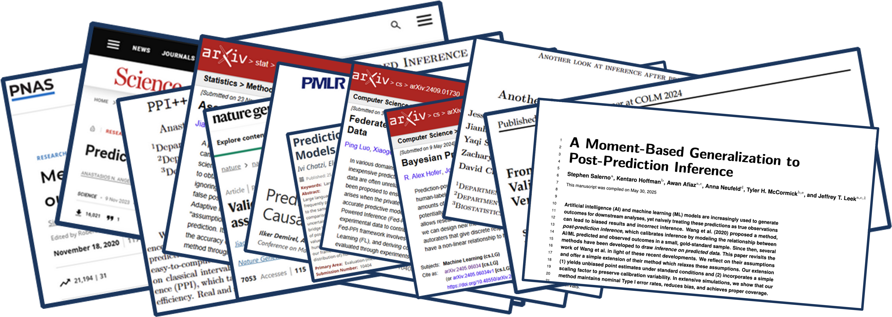
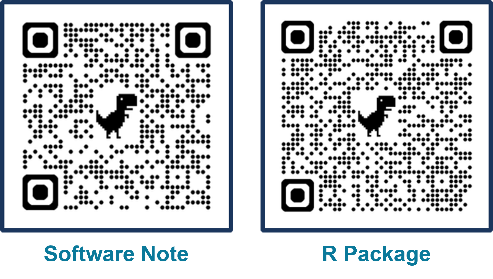
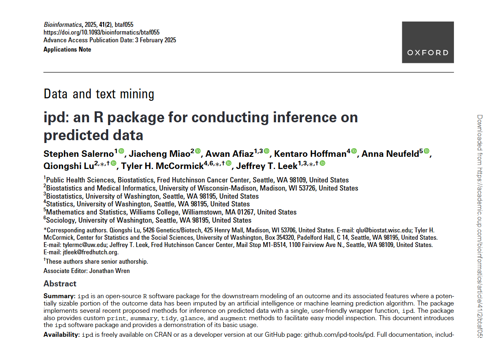

## A a link to these slides {.theme-bg3}

### If you would like to follow along on your own device

<br>

{width="35%" fig-align="center"}

::: {.footer}
[salernos.github.io/2026-washu-talking-public-health](salernos.github.io/2026-washu-talking-public-health)
:::

## First, Some Acknowledgements {.theme-bg3}

### This slide is by no means exhaustive

It represents individuals who have contributed most recently to the papers I have highlighted in this talk.

<br>

{width="50%" fig-align="center"}

## Public Health in a World Where We Can Predict Anything {.theme-bg3}

## Public Health in a World Where We [*Think We*]{style="color: #00C1D5;"} Can Predict Anything {.theme-bg3}

## Public Health in a World [*that Would Benefit if*]{style="color: #00C1D5;"} We [*Could*]{style="color: #00C1D5;"} Predict Anything {.theme-bg3}

## A high-level overview of this talk {.theme-bg3}

### Public health has always dealt with incomplete measurement because many outcomes are:

<br>

::: {layout="[[1,1,1],[1,1,1]]"}

::: {.fragment fragment-index="1"}
[*Expensive*]{style="color: #00C1D5;"}: 

Dual-Energy X-ray Absorptiometry Scans
:::

::: {.fragment fragment-index="3"}
[*Difficult to observe*]{style="color: #00C1D5;"}: 

Protein Structures
:::

::: {.fragment fragment-index="5"}
[*Never recorded*]{style="color: #00C1D5;"}: 

Causes of Death
:::

::: {.fragment fragment-index="2"}
![[Source: my.clevelandclinic.org/health/diagnostics/10683-dexa-dxa-scan-bone-density-test]{.caption}](images/dexa.jpg)
:::

::: {.fragment fragment-index="4"}
![[Source: my.clevelandclinic.org/health/diagnostics/10683-dexa-dxa-scan-bone-density-test]{.caption}](images/AlphaFold2.png)
:::

::: {.fragment fragment-index="6"}
![[Source: papp.iussp.org/sessions/papp104_s01/PAPP104_s01_080_010.html]{.caption}](images/va_map.png)
:::

:::

## A high-level overview of this talk {.theme-bg3}

<br>

- In practice, this means some populations count less simply because they are [*harder to measure*]{style="color: #00C1D5;"}
- Predicting missing data creates an opportunity to [*extend evidence*]{style="color: #00C1D5;"}, but [*predictions are imperfect*]{style="color: #00C1D5;"}
- What is new is that AI makes predicted 'data' increasingly [*cheap*]{style="color: #00C1D5;"}, [*scalable*]{style="color: #00C1D5;"}, and [*pervasive*]{style="color: #00C1D5;"}
- My work focuses on how to generate and use predicted data without sacrificing [*rigor*]{style="color: #00C1D5;"}, [*reproducibility*]{style="color: #00C1D5;"}, or [*validity*]{style="color: #00C1D5;"}

# What is AI? Why now? {.theme-bg2}

## What is AI? A three-part definition {.theme-bg3}

<br>

::: {.columns}

::: {.column width="40%"}

### 1. Data

![[Source: https://www.innerdoc.com/periodic-table-of-nlp-tasks/14-tokenization/]{.caption}](images/ai_data.png){fig-align="center"}

:::

::: {.column width="5%"}
:::

::: {.column width="20%"}

### 2. Algorithm

![[Source: https://arxiv.org/abs/1706.03762]{.caption}](images/ai_algorithm.png){fig-align="center"}

:::

::: {.column width="5%"}
:::

::: {.column width="30%"}

### 3. Interface

![[Source: https://chatgpt.com/]{.caption}](images/ai_interface.png){fig-align="center"}

:::

:::

::: {.footer}
[https://simplystatistics.org/posts/2017-01-19-what-is-artificial-intelligence/](https://simplystatistics.org/posts/2017-01-19-what-is-artificial-intelligence/)
:::

## Why is this happening now? {.theme-bg3}

### Simultaneous revolutions in computing and biology

<br>

::::: columns
::: {.column width="50%"}
![[Source: https://www.ark-invest.com/articles/analyst-research/ai-training]{.caption}](images/revolution1.png){fig-align="center"}
:::

::: {.column width="50%"}
![[Source: https://digitalfoodlab.com/graph-week-genome-sequencing-price-going/]{.caption}](images/revolution2.png){fig-align="center"}
:::
:::::

::: {.footer font-size="0.75em !important"}
Adapted from *Post-prediction inference*. Source: jtleek.com/talks
:::

## What does this mean for how we collect data? {.theme-bg3 auto-animate="true"}

### A simple sample size calculation

::: {.r-fit-text text-color="#1B365D"}
$$
N = \text{Sample Size}
$$
:::

::: {.footer}
Courtesy of Ingo Ruczinski
:::

## What does this mean for how we collect data? {.theme-bg3 auto-animate="true"}

### A simple sample size calculation

::: {.r-fit-text text-color="#1B365D"}
$$
N = \frac{\$ \text{ You Have }}{\$ \text{ Per Sample }}
$$
:::

::: {.footer}
Courtesy of Ingo Ruczinski
:::

# Thinking of AI as an exposure {.theme-bg2}

## AI is an exposure {.theme-bg3}

### We need to think of AI 'emissions' like an epidemiologist would

<br> 

::: {.columns}
::: {.column width="60%"}

<br>

- It is rapidly spreading throughout both the scientific and general communities
- It is influencing public health research and public health practice
- It has the capacity to do good or harm 
:::

::: {.column width="40%"}
![[Preprint provided by the authors]{.caption}](images/AIEpi.PNG){width="120%"}
:::
:::

## LLM breakthroughs have driven AI's current momentum {.theme-bg3}

<br>

![[Source: medium.com/@lmpo/a-brief-history-of-lmms-from-transformers-2017-to-deepseek-r1-2025-dae75dd3f59a]{.caption}](images/llm_breakthroughs.png)

## AI is everywhere, and it is spreading faster than ever {.theme-bg3}

<br>

![[Source: https://www.nebuly.com/blog/2024-the-year-of-llm-user-intelligence]{.caption}](images/ai_spread.png){width="50%" fig-align="center"}

## And it is influencing modern science {.theme-bg3}

### 2024 Nobel Prizes in biology and chemistry went to AI breakthroughs

<br>

::: {.columns}
::: {.column width="50%"}
![[Source: nature.com/articles/s41746-024-01345-9]{.caption}](images/nobel_two.png){width="75%" fig-align="center"}
:::

::: {.column width="50%"}
![[Source: nature.com/articles/d41586-024-03214-7]{.caption}](images/AlphaFold1.png){width="65%" fig-align="center"}
:::
:::

## This illustrates a broader shift {.theme-bg3}

### The scale and diversity of AI applications is part of what makes this moment different

-   The design and pace of data collection is rapidly changing
-   Predictions are now becoming input 'data' for public health science
-   This creates a need for rigorous, open statistical [*interventions*]{style="color: #00C1D5;"}

# Predictions as 'data' are already <br> everywhere in public health {.theme-bg2}

## Neighborhood characteristics from street view images... {.theme-bg3}

<br>

::: {.columns}
::: {.column width="60%"}
::: {.fragment}
![[Source: https://www.pnas.org/doi/abs/10.1073/pnas.1700035114]{.caption}](images/Paper1.png){width="65%" fig-align="center"}
:::
:::

::: {.column width="40%"}
::: {.fragment}
"We show that socioeconomic attributes such as income, race, education, and voting patterns can be inferred from cars detected in Google Street View images using deep learning."
:::
:::
:::

## Malnutrition risk from remotely sensed and field data... {.theme-bg3}

<br>

::: {.columns}
::: {.column width="60%"}
::: {.fragment}
![[Source: https://www.pnas.org/doi/10.1073/pnas.2416161122]{.caption}](images/Paper2.png){width="65%" fig-align="center"}
:::
:::

::: {.column width="40%"}
::: {.fragment}
"We combine supervised machine learning methods and remotely sensed feature sets with time series child anthropometric data ... to generate accurate forecasts of acute malnutrition at operationally meaningful time horizons."
:::
:::
:::

## Poverty from satellite images of nighttime lights... {.theme-bg3}

<br>

::: {.columns}
::: {.column width="60%"}
::: {.fragment}
![[Source: https://www.science.org/doi/10.1126/science.aaf7894]{.caption}](images/Paper3.png){width="65%" fig-align="center"}
:::
:::

::: {.column width="40%"}
::: {.fragment}
"With a bit of machine-learning wizardry, the combined images can be converted into accurate estimates of household consumption and assets, both of which are hard to measure in poorer countries."
:::
:::
:::

## Influenza activity from search/query behavior... {.theme-bg3}

<br>

::: {.columns}
::: {.column width="60%"}
::: {.fragment}
![[Source: https://www.nature.com/articles/nature07634]{.caption}](images/Paper4.png){width="65%" fig-align="center"}
:::
:::

::: {.column width="40%"}
::: {.fragment}
"Here we present a method of analysing large numbers of Google search queries to track influenza-like illness in a population."
:::
:::
:::

## In these examples, prediction is becoming part of data collection {.theme-bg3}

### In many public health settings, we have:

<br>

- An outcome we really care about
- Access to cheaper or more scalable data
- An algorithm that maps these data to a prediction of the outcome

## We can find examples in many fields and everywhere in between {.theme-bg3}

### Here are two very different examples from my work 

<br>

::: {.columns}
::: {.column width="50%"}
**Complex Predictions:** Cause of Death from Verbal Autopsies

![[Source: www.who.int/publications/m/item/2022-who-verbal-autopsy-manual-for-supervisors]{.caption}](images/va_cover.png){width="50%" fig-align="center"}
:::

::: {.column width="50%"}
**Simple Predictions:** BMI as a Proxy for Adiposity

![[Source: hsph.harvard.edu/news/bmi-a-poor-metric-for-measuring-peoples-health-say-experts/]{.caption}](images/bmi_cover.png){width="80%" fig-align="center"}
:::
:::

## Less than 1/3 of deaths worldwide are assigned a medically certified cause {.theme-bg3}

### When deaths occur outside the medical system, cause of death must be *predicted* rather than observed

Verbal autopsy (VA) is a time-consuming, resource-intensive process that asks interviewees to relive their grief in detail

<br>

![[Source: https://publichealthnotes.com/verbal-autopsy-and-mpdsr/]{.caption}](images/va_overview.png)

## Recent work leverages unstructured interviews for automated VA {.theme-bg3}

### Narrative summaries + AI/ML predictions would be less resource intensive than current standard

<br>

![[Source: https://journals.plos.org/plosone/article?id=10.1371/journal.pone.0308452/]{.caption}](images/va_narratives.png)

## We studied how different AI/ML methods can classify cause of death {.theme-bg3}

### Comparing methods such as KNN, SVM, BERT, and GPT-4 using only the narrative summaries

<br>

![[Source: https://openreview.net/forum?id=QbCHlIqbDJ]{.caption}](images/va_colm.png)

## Using data from the Population Health Metrics Research Consortium {.theme-bg3}

### N = 6,763 observations from 6 sites in 4 countries; adults only, 5 cause of death labels

<br>

::: {.columns}
::: {.column width="50%"}
**Focusing on one site (Uttar Pradesh)**:

- GPT-4 had the highest accuracy (0.75) using only unstructured narratives
- Performance was comparable to existing VA models
- Unlike traditional classifiers, GPT-4 could say 'I don't know.'
- 1,503 of 6,763 cases were labeled unclassified
- Manual review confirmed these narratives contained insufficient information for COD assignment
:::

::: {.column width="50%"}
![[Source: https://openreview.net/forum?id=QbCHlIqbDJ]{.caption}](images/va_data.png)
:::
:::

## But *prediction* is not the same as *inference* {.theme-bg3}

<br>

::: {.columns}
::: {.column width="50%"}

::: {.fragment}
### A demographer's actual questions may be: 

- How does cause of death vary by geography?
- Are there changes over time in those causes?
- What are the reasons underlying these effects?
:::

::: {.fragment}
### How do we answer these questions?

- With statistical and epidemiological models
:::

::: {.fragment}
### The challenge:

- We have *predicted,* rather than observed, cause of death 
:::
:::

::: {.column width="50%"}

*"Value of Verbal Autopsy in a Fragile Setting: Reported versus Estimated Community Deaths Associated with COVID-19, Banadir, Somalia"*

![[Source: mdpi.com/2076-0817/12/2/328]{.caption}](images/va_trend.jpg)
:::
:::

## Predictions also don't have to be complex to be biased {.theme-bg3}

### The case of body mass index (BMI; kg/m$^2$) as an imperfect measure of adiposity

<br>

![[Source: https://www.nytimes.com/2024/11/14/well/obesity-epidemic-america.html]{.caption}](images/bmi_overview.png)

## An 'algorithm' is just a set of steps that map inputs to outputs {.theme-bg3}

### BMI is one of several potential adiposity 'prediction algorithms'

-   BMI (≥ 30 kg/m²)
-   Waist circumference (men ≥ 102 cm; women ≥ 88 cm)
-   **Gold-Standard**: Dual-Energy X-ray Absorptiometry (DXA) % body fat (\> 30% men; \> 42% women)

<br>

![[Source: https://www.medrxiv.org/content/10.1101/2025.04.01.25325037v1.full.pdf]{.caption}](images/bmi_algorithm.png)

## We used NHANES to understand BMI/WC in population-level inference {.theme-bg3}

### BMI/WC/DXA all collected up until COVID-19, when DXA collection was suspended

<br>

::: {.columns}
::: {.column width=60%"}

```{r}

#--- Load Packages

library(ipd)
library(broom)
library(scales)
library(tidyverse)

#--- Read-In Data

load("data/NHANES.RData")

#--- Define Obesity Categories

NHANES <- NHANES |>
  mutate(
    obese_BMI = BMXBMI >= 30,
    obese_WC  = case_when(
      Sex == "Male"   & BMXWAIST >= 102 ~ TRUE,
      Sex == "Female" & BMXWAIST >=  88 ~ TRUE,
      .default                          = FALSE),
    obese_DXA = case_when(
      is.na(DXDTOPF)                 ~ NA,
      Sex == "Male"   & DXDTOPF > 30 ~ TRUE,
      Sex == "Female" & DXDTOPF > 42 ~ TRUE,
      .default                       = FALSE)
  )

nhanes_long <- NHANES |>
  select(Cohort, Age, Sex, Race, obese_BMI, obese_WC, obese_DXA) |>
  pivot_longer(
    cols = starts_with("obese_"),
    names_to = "Measure",
    values_to = "Obese"
  ) |>
  mutate(
    Measure = recode(Measure,
      obese_BMI = "BMI",
      obese_WC  = "Waist Circumference",
      obese_DXA = "DXA"
    )
  ) |>
  filter(!is.na(Obese))

prop_sex <- nhanes_long |>
  group_by(Cohort, Sex, Measure, Obese) |>
  summarize(n = n(), .groups = "drop") |>
  group_by(Cohort, Sex, Measure) |>
  mutate(prop = n / sum(n))

ggplot(prop_sex, aes(x = Sex, y = prop, fill = Obese)) +
  geom_col(position = "stack") +
  facet_grid(Cohort ~ Measure) +
  scale_y_continuous(labels = percent_format(accuracy = 1)) +
  scale_fill_manual(values = c("#00C1D5", "#AA4AC4")) +
  scale_color_manual(values = c("#00C1D5", "#AA4AC4")) +
  labs(
    x     = "\nSex",
    y     = "Percent\n",
    fill  = "Obesity Status:",
    title = "Obesity Classification by Sex, Cohort, and Measure"
  ) +
  theme_minimal() +
  theme(legend.position = "bottom")

```

:::

::: {.column width="40%"}
![[Source: https://www.medrxiv.org/content/10.1101/2025.04.01.25325037v1.full.pdf]{.caption}](images/bmi_paper.png)
:::
:::

## Mismatched quadrants suggest limitations in BMI/WC {.theme-bg3}

### BMI/WC are (at best) noisy proxies:

-   Varies by sex, age, race/ethnicity, muscle mass, fat distribution
-   Systematically biased for some groups

```{r}

cutoffs <- tibble(
  label = c("BMI", "BMI", "Waist Circumference", "Waist Circumference"),
  Sex  = c("Male", "Female", "Male", "Female"),
  xint = c(30, 30, 102, 88),
  yint = c(30, 42,  30, 42)
)

NHANES |>
  filter(Cohort == "2017-2018") |>
  pivot_longer(c(BMXBMI, BMXWAIST)) |>
  mutate(
    label = case_when(
      name == "BMXBMI" ~ "BMI", name == "BMXWAIST" ~ "Waist Circumference")) |>
  ggplot(aes(x = value, y = DXDTOPF, group = Sex, fill = Sex, color = Sex)) +
    facet_wrap(~ label, scales = "free_x") +
    geom_point(alpha = 0.4) +
    geom_smooth(method = "lm") +
    geom_vline(data = cutoffs, 
      aes(xintercept = xint, color = Sex), linetype = "dashed") +
    geom_hline(data = cutoffs, 
      aes(yintercept = yint, color = Sex), linetype = "dashed") +
    scale_fill_manual(values = c("#00C1D5", "#AA4AC4")) +
    scale_color_manual(values = c("#00C1D5", "#AA4AC4")) +
    labs(
      title = "DXA % Body Fat vs BMI and WC (2017-2018)",
      x = "\nBMI (kg/m2) or Waist Circumference (cm)", y = "% Body Fat\n") +
    theme_minimal()

```

## Good predictions can be useful, but predictions are not measurements {.theme-bg3}

### That distinction matters when our goal is not just predictive accuracy, but:

- Estimation
- Uncertainty quantification
- Regression
- Hypothesis testing
- Population-level inference

# Consider a setup that might be <br> pertinent to your own work {.theme-bg2}

## We are studying the relationship between an outcome ($Y$) and covariates ($X$) {.theme-bg3 auto-animate="true"}

In our VA work, $Y$ is cause of death and $X$ are sociodemographic factors like age or country of origin

In our BMI work, $Y$ is true adiposity (% body fat) and $X$ are demographic factors like age or sex

<br>

::: {.r-hstack}
::: {.data-label .label-yf data-id="ytext"}
Outcome:
:::

::: {.data-label .label-xz data-id="xtext"}
Covariates:
:::
:::

::: {.r-hstack}
::: {.data-label .label-yf data-id="ytext"}
\% Body Fat
:::

::: {.data-label .label-xz data-id="xtext"}
Age, Sex
:::
:::

::: {.r-hstack}
::: {.data-box .box-yl data-id="yl"}
Y
:::

::: {.data-box .box-xl data-id="xl"}
X
:::
:::

## We also have data ($Z$) that are predictive of our outcome {.theme-bg3 auto-animate="true"}

In our VA work, $Z$ are our structure VA questionnaires and narrative summaries

In our BMI work, $Z$ are anthropometric measurements (height and weight)

<br>

::: {.r-hstack}
::: {.data-label .label-yf data-id="ytext"}
Outcome:
:::

::: {.data-label .label-xz data-id="xtext"}
Covariates:
:::

::: {.data-label .label-xz data-id="ztext"}
Predictors:
:::
:::

::: {.r-hstack}
::: {.data-label .label-yf data-id="ytext"}
\% Body Fat
:::

::: {.data-label .label-xz data-id="xtext"}
Age, Sex
:::

::: {.data-label .label-xz data-id="ztext"}
Height, Weight
:::
:::

::: {.r-hstack}
::: {.data-box .box-yl data-id="yl"}
Y
:::

::: {.data-box .box-xl data-id="xl"}
X
:::

::: {.data-box .box-zl data-id="zl"}
Z
:::
:::

## In many cases, unlabeled features ($X,Z$) are cheap and easy to collect {.theme-bg3 auto-animate="true"}

### Our outcome of interest, however, can be time-consuming or costly to obtain

<br>

::: {.r-hstack}
::: {.data-label .label-yf data-id="ytext"}
Outcome:
:::

::: {.data-label .label-xz data-id="xtext"}
Covariates:
:::

::: {.data-label .label-xz data-id="ztext"}
Predictors:
:::
:::

::: {.r-hstack}
::: {.data-label .label-yf data-id="ytext"}
% Body Fat
:::

::: {.data-label .label-xz data-id="xtext"}
Age, Sex
:::

::: {.data-label .label-xz data-id="ztext"}
Height, Weight
:::
:::

::: {.r-hstack}
::: {.data-box .box-yl data-id="yl"}
Y
:::

::: {.data-box .box-xl data-id="xl"}
X
:::

::: {.data-box .box-zl data-id="zl"}
Z
:::
:::

::: {.r-hstack}
::: {.data-box .box-yu data-id="yu"}
Y
:::

::: {.data-box .box-xu data-id="xu"}
X
:::

::: {.data-box .box-zu data-id="zu"}
Z
:::
:::

## We can use accessible data and an algorithm to generate predictions {.theme-bg3 auto-animate="true"}

### We make no assumptions about the quality of these predictions or the models they come from

<br>

::: {.r-hstack}
::: {.data-label .label-yf data-id="ytext"}
Outcome:
:::

::: {.data-label .label-yf data-id="ftext"}
Prediction:
:::

::: {.data-label .label-xz data-id="xtext"}
Covariates:
:::

::: {.data-label .label-xz data-id="ztext"}
Predictors:
:::
:::

::: {.r-hstack}
::: {.data-label .label-yf data-id="ytext"}
% Body Fat
:::

::: {.data-label .label-yf data-id="ftext"}
BMI
:::

::: {.data-label .label-xz data-id="xtext"}
Age, Sex
:::

::: {.data-label .label-xz data-id="ztext"}
Height, Weight
:::
:::

::: {.r-hstack}
::: {.data-box .box-yl data-id="yl"}
Y
:::

::: {.data-box .box-fl data-id="fl"}
f
:::

::: {.data-box .box-xl data-id="xl"}
X
:::

::: {.data-box .box-zl data-id="zl"}
Z
:::
:::

::: {.r-hstack}
::: {.data-box .box-yu data-id="yu"}
Y
:::

::: {.data-box .box-fu data-id="fu"}
f
:::

::: {.data-box .box-xu data-id="xu"}
X
:::

::: {.data-box .box-zu data-id="zu"}
Z
:::
:::

# So what are our options for inference? {.theme-bg2}

## Option 1: Classical Inference {.theme-bg3}

### Estimate our statistic of interest with only the observations that have measured outcomes

[$Y$]{style="color: #AA4AC4;"} = [$\beta$]{style="color: #AA4AC4;"} [$X$]{style="color: #1B365D;"} 

[$\text{% Body Fat}$]{style="color: #AA4AC4;"} = [$\beta$]{style="color: #AA4AC4;"} [$\text{Sex}$]{style="color: #1B365D;"}

<br>

::: {.columns}
::: {.column width="50%"}

::: {.r-hstack}
::: {.data-label .label-yf data-id="ytext"}
Outcome:
:::

::: {.data-label .label-yf data-id="ftext"}
Prediction:
:::

::: {.data-label .label-xz data-id="xtext"}
Covariates:
:::

::: {.data-label .label-xz data-id="ztext"}
Predictors:
:::
:::

::: {.r-hstack}
::: {.data-label .label-yf data-id="ytext"}
% Body Fat
:::

::: {.data-label .label-yf data-id="ftext"}
BMI
:::

::: {.data-label .label-xz data-id="xtext"}
Age, Sex
:::

::: {.data-label .label-xz data-id="ztext"}
Height, Weight
:::
:::

::: {.r-hstack}
::: {.data-box .box-yl data-id="yl"}
Y
:::

::: {.data-box .box-fl .is-faded data-id="fl"}
:::

::: {.data-box .box-xl data-id="xl"}
X
:::

::: {.data-box .box-zl .is-faded data-id="zl"}
:::
:::

::: {.r-hstack}
::: {.data-box .box-yu .is-faded data-id="yu"}
:::

::: {.data-box .box-fu .is-faded data-id="fu"}
:::

::: {.data-box .box-xu .is-faded data-id="xu"}
:::

::: {.data-box .box-zu .is-faded data-id="zu"}
:::
:::

::: {.fragment}
::: {.bottom-metrics}
::: {.metric-box .metric-green data-id="bias"}
Low Bias
:::

::: {.metric-box .metric-red data-id="precision"}
High Variance
:::
:::
:::
:::

::: {.column width="50%"}

Estimate [$\hat{\beta}_{\text{lab}}$]{style="color: #AA4AC4;"} by regressing [$Y$]{style="color: #AA4AC4;"} on [$X$]{style="color: #1B365D;"}

<br>

**Advantages:**

- Targets the right scientific quantity
- Low bias if the labeled set is representative

**Problems:**

- Throws away information on many observations
- Potential to miss important signals

:::
:::

## Option 2: Naive Inference {.theme-bg3 auto-animate="true"}

### Treat the predicted outcomes as if they were measured and use all observations

[$f$]{style="color: #00C1D5;"} = [$\gamma$]{style="color: #00C1D5;"} [$X$]{style="color: #1B365D;"}

[$\text{BMI}$]{style="color: #00C1D5;"} = [$\gamma$]{style="color: #00C1D5;"} [$\text{Sex}$]{style="color: #1B365D;"}

<br>

::: {.columns}
::: {.column width="50%"}

::: {.r-hstack}
::: {.data-label .label-yf data-id="ytext"}
Outcome:
:::

::: {.data-label .label-yf data-id="ftext"}
Prediction:
:::

::: {.data-label .label-xz data-id="xtext"}
Covariates:
:::

::: {.data-label .label-xz data-id="ztext"}
Predictors:
:::
:::

::: {.r-hstack}
::: {.data-label .label-yf data-id="ytext"}
% Body Fat
:::

::: {.data-label .label-yf data-id="ftext"}
BMI
:::

::: {.data-label .label-xz data-id="xtext"}
Age, Sex
:::

::: {.data-label .label-xz data-id="ztext"}
Height, Weight
:::
:::

::: {.r-hstack}
::: {.data-box .box-yl .is-faded data-id="yl"}
:::

::: {.data-box .box-fl data-id="fl"}
f
:::

::: {.data-box .box-xl data-id="xl"}
X
:::

::: {.data-box .box-zl .is-faded data-id="zl"}
:::
:::

::: {.r-hstack}
::: {.data-box .box-yu .is-faded data-id="yu"}
:::

::: {.data-box .box-fu data-id="fu"}
f
:::

::: {.data-box .box-xu data-id="xu"}
X
:::

::: {.data-box .box-zu .is-faded data-id="zu"}
:::
:::

::: {.fragment}
::: {.bottom-metrics}
::: {.metric-box .metric-red data-id="bias"}
High Bias
:::

::: {.metric-box .metric-red data-id="precision"}
Low Variance$^\star$
:::
:::
:::

:::

::: {.column width="50%"}

Estimate [$\hat{\gamma}_{\text{all}}$]{style="color: #00C1D5;"}, by regressing [$f$]{style="color: #00C1D5;"} on [$X$]{style="color: #1B365D;"}

<br>

**Perceived Advantages:**

- Uses the full data
- Easy, scalable, (artificially) more precise

**Problems:**

- Standard errors can be too optimistic*
- Estimates target the wrong quantity

:::
:::

## In our verbal autopsy work {.theme-bg3}

<br>

```{r}

library(tidyverse)

#--- Read-In Data

va_df <- readr::read_csv("data/VA.csv", show_col_types = FALSE)

#--- Helper Parsers

# parse strings like:
# "[ 0.01435741 -0.00823518 -0.01918385  0.04426635 ]"
# or "[[ 0.0125 0.0040 -0.0294 0.0429 ]]"

parse_num_vec <- function(x) {
  x |>
    stringr::str_replace_all("\\n", " ") |>
    stringr::str_replace_all("\\(|\\)|\\[|\\]|array", " ") |>
    stringr::str_squish() |>
    stringr::str_extract_all("[-+]?[0-9]*\\.?[0-9]+(?:[eE][-+]?[0-9]+)?") |>
    purrr::pluck(1) |>
    as.numeric()
}

# parse CI columns and return a tibble with lower/upper per coefficient
# works for formats like:
# "[[[ 0.007 0.017 ]] [[-0.001 0.009]] ... ]"
# or "(array([lower...]), array([upper...]))"

parse_ci_mat <- function(x) {
  nums <- x |>
    stringr::str_replace_all("\\n", " ") |>
    stringr::str_replace_all("\\(|\\)|\\[|\\]|array", " ") |>
    stringr::str_squish() |>
    stringr::str_extract_all("[-+]?[0-9]*\\.?[0-9]+(?:[eE][-+]?[0-9]+)?") |>
    purrr::pluck(1) |>
    as.numeric()

  n <- length(nums)

  # Case 1: lower1 upper1 lower2 upper2 ...
  if (n %% 2 == 0) {
    
    half <- n / 2

    # Try "stacked lower then upper" format first
    lower1 <- nums[1:half]
    upper1 <- nums[(half + 1):n]

    # If that looks wrong, fall back to pairwise parsing
    if (all(lower1 <= upper1)) {
      tibble(conf.low = lower1, conf.high = upper1)
    } else {
      tibble(
        conf.low  = nums[c(TRUE, FALSE)],
        conf.high = nums[c(FALSE, TRUE)]
      )
    }
  } else {
    stop("Could not parse CI column: odd number of numeric entries found.")
  }
}

#--- Convert One Row Into Long Format

parse_row_results <- function(site, model,
                              baseline_pe, baseline_ci,
                              naive_pe, naive_ci,
                              ppi_pe, ppi_ci) {

  b_pe <- parse_num_vec(baseline_pe)
  n_pe <- parse_num_vec(naive_pe)
  p_pe <- parse_num_vec(ppi_pe)

  b_ci <- parse_ci_mat(baseline_ci)
  n_ci <- parse_ci_mat(naive_ci)
  p_ci <- parse_ci_mat(ppi_ci)

  stopifnot(length(b_pe) == nrow(b_ci))
  stopifnot(length(n_pe) == nrow(n_ci))
  stopifnot(length(p_pe) == nrow(p_ci))

  bind_rows(
    tibble(
      site = site,
      model = model,
      method = "True COD",
      coef_id = seq_along(b_pe),
      estimate = b_pe,
      conf.low = b_ci$conf.low,
      conf.high = b_ci$conf.high
    ),
    tibble(
      site = site,
      model = model,
      method = "VA COD",
      coef_id = seq_along(n_pe),
      estimate = n_pe,
      conf.low = n_ci$conf.low,
      conf.high = n_ci$conf.high
    ),
    tibble(
      site = site,
      model = model,
      method = "IPD Corrected",
      coef_id = seq_along(p_pe),
      estimate = p_pe,
      conf.low = p_ci$conf.low,
      conf.high = p_ci$conf.high
    )
  )
}

#--- Parse All Rows

va_plot_df <- purrr::pmap_dfr(
  va_df,
  \(site, model, baseline_pe, baseline_ci, naive_pe, naive_ci, ppi_pe, ppi_ci, ppi_lhat, ppi_se) {
    parse_row_results(
      site = site,
      model = model,
      baseline_pe = baseline_pe,
      baseline_ci = baseline_ci,
      naive_pe = naive_pe,
      naive_ci = naive_ci,
      ppi_pe = ppi_pe,
      ppi_ci = ppi_ci
    )
  }
)

#--- Coefficient Labels

va_plot_df <- va_plot_df |>
  mutate(
    coef = factor(
      coef_id,
      levels = sort(unique(coef_id)),
      labels = c("Communicable", "External", "Maternal", "Non-Communicable")
    ),
    method = factor(method, levels = c("True COD", "VA COD", "IPD Corrected"))
  )

#--- Forest Plot

va_plot_df |>
  filter(site == "dar", model == "KNN", method != "IPD Corrected") |>

  ggplot(aes(x = estimate, y = coef, xmin = conf.low, xmax = conf.high, color = method)) +
    geom_vline(xintercept = 0, linetype = 2, linewidth = 1.1, color = "gray50") +
    geom_linerange(position = position_dodge2(width = 0.5), linewidth = 5) +
    geom_point(position = position_dodge2(width = 0.5), size = 3, color = "white") +
    geom_segment(
      aes(x = 0.0325, xend = 0.005, y = 3, yend = 2.3), linewidth = 2, color = "red",
      arrow = arrow(length = unit(0.15, "cm"))) +
    geom_segment(
      aes(x = 0.065, xend = 0.07, y = 3.75, yend = 3.95), linewidth = 2, color = "red",
      arrow = arrow(length = unit(0.15, "cm"))) +
    annotate("text", x = 0.05, y = 3, fontface = "bold", color = "red",
      label = "Naive estimates\n can disagree in\n magnitude and\n significance!") +
    scale_color_manual(values = c("#AA4AC4", "#00C1D5", "#FFB500")) +
    labs(
      x = "\nLog-Odds Ratio for Age",
      y = "Cause of Death Label\n",
      title = "Multiclass Logistic Regression of COD on Age",
      subtitle = "Site: Dar es Salaam, Model: KNN",
      color = "Outcome:") +
    theme_bw(base_size = 12) +
    theme(
      panel.grid.minor = element_blank(),
      strip.background = element_rect(fill = "gray95"),
      legend.position = "bottom")

```

## And our BMI study! {.theme-bg3}

<br>

```{r}

# Split NHANES into labeled (DXA available) vs unlabeled
labeled   <- NHANES |> filter(Cohort == "2017-2018")
unlabeled <- NHANES |> filter(Cohort == "2021-2023")

# Stack for PB Inference
combined <- bind_rows(
  labeled   |> mutate(set_label = "labeled"),
  unlabeled |> mutate(set_label = "unlabeled")
)

# Naive on unlabeled using BMI
naive_bmi_fit <- glm(obese_BMI ~ Sex, 
  family = binomial, data = unlabeled)
naive_bmi_df  <- broom::tidy(naive_bmi_fit) |>
  mutate(method = "BMI")

# Naive on unlabeled using WC
naive_wc_fit <- glm(obese_WC ~ Sex,
  family = binomial, data = unlabeled)
naive_wc_df  <- broom::tidy(naive_wc_fit) |>
  mutate(method = "Waist Circumference")

# Classical on labeled using DXA
class_fit <- glm(obese_DXA ~ Sex,
  family = binomial, data = labeled)
class_df  <- broom::tidy(class_fit) |>
  mutate(method = "% Body Fat")

# Combine
coef_df <- bind_rows(naive_bmi_df, naive_wc_df, class_df) |>
  filter(term != "(Intercept)") |>
  mutate(
    term = recode(term,
      "SexFemale" = "Female (vs Male)"
    ),
    method = factor(method, levels = c("BMI", "Waist Circumference", "% Body Fat"))
  )
    
# Forest plot
ggplot(coef_df, aes(x = estimate, y = term, color = method, shape = method, group = method)) +
  geom_vline(xintercept = 0, linetype = 2, linewidth = 1.1, color = "gray50") +
  geom_linerange(aes(xmin = estimate - 1.96 * std.error, xmax = estimate + 1.96 * std.error),
    position = position_dodge2(width = 0.75), linewidth = 5) +
  geom_point(position = position_dodge2(width = 0.75), size = 3, color = "white", fill = "white") +
  geom_segment(
    aes(x = -0.05, xend = -0.25, y = 1.15, yend = 1.2), linewidth = 2, color = "red",
    arrow = arrow(length = unit(0.15, "cm"))) +
  geom_segment(
    aes(x = 0.25, xend = 0.22, y = 0.95, yend = 0.85), linewidth = 2, color = "red",
    arrow = arrow(length = unit(0.15, "cm"))) +
  geom_segment(
    aes(x = 0.6, xend = 0.65, y = 1.1, yend = 1.075), linewidth = 2, color = "red",
    arrow = arrow(length = unit(0.15, "cm"))) +
  annotate("text", x = 0.3, y = 1.1, fontface = "bold", color = "red",
    label = "Opposite conclusions\n depending on outcome!") +
  scale_color_manual(values = c("#00C1D5", "#00C1D5", "#AA4AC4")) +
  scale_shape_manual(values = c(16, 17, 16)) +
  labs(
    x = "\nLog-Odds Ratio for Sex",
    y = "Covariate\n",
    title = "Logistic Regression of Obesity on Sex",
    color = "Outcome:",
    shape = "Outcome:") +
  theme_bw(base_size = 12) +
  theme(
    panel.grid.minor = element_blank(),
    strip.background = element_rect(fill = "gray95"),
    legend.position = "bottom")

```


##

::: {.kicker}
If we treat predictions like measured data, we get **confident** answers to the **wrong** questions.
:::

## Option 3: We need methods for inference with predicted data (IPD) {.theme-bg3 auto-animate="true"}

### We want to use all available data to minimize bias and variance

We leverage the subset of data with measured outcomes to calibrate inference in the larger study

<br>

::: {.r-hstack}
::: {.data-label .label-yf data-id="ytext"}
Y
:::

::: {.data-label .label-yf data-id="ftext"}
f
:::

::: {.data-label .label-xz data-id="xtext"}
X
:::

::: {.data-label .label-xz data-id="ztext"}
Z
:::
:::

::: {.r-hstack}
::: {.data-label .label-yf data-id="ytext"}
True COD
:::

::: {.data-label .label-yf data-id="ftext"}
VA COD
:::

::: {.data-label .label-xz data-id="xtext"}
Age, Country of Origin
:::

::: {.data-label .label-xz data-id="ztext"}
VA Questionnaire
:::
:::

::: {.r-hstack}
::: {.data-label .label-yf data-id="ytext"}
\% Body Fat
:::

::: {.data-label .label-yf data-id="ftext"}
BMI
:::

::: {.data-label .label-xz data-id="xtext"}
Age, Sex
:::

::: {.data-label .label-xz data-id="ztext"}
Height, Weight
:::
:::

::: {.r-hstack}
::: {.data-box .box-yl data-id="yl"}
:::

::: {.data-box .box-fl data-id="fl"}
:::

::: {.data-box .box-xl data-id="xl"}
:::

::: {.data-box .box-zl data-id="zl"}
:::
:::

::: {.r-hstack}
::: {.data-box .box-yu data-id="yu"}
:::

::: {.data-box .box-fu data-id="fu"}
:::

::: {.data-box .box-xu data-id="xu"}
:::

::: {.data-box .box-zu data-id="zu"}
:::
:::

## The first IPD approach: Post-Prediction Inference (PostPI) {.theme-bg3}

### The authors made key observation that the predicted and true outcomes often have a simple relationship

<br>

::::: columns
::: {.column width="50%"}
![[Source: https://www.pnas.org/doi/abs/10.1073/pnas.2001238117]{.caption}](images/wang_knn.png){fig-align="center"}
:::

::: {.column width="50%"}
![[Source: https://www.pnas.org/doi/abs/10.1073/pnas.2001238117]{.caption}](images/wang_paper.png){fig-align="center"}
:::
:::::

## And that predicted and true outcomes often have this simple relationship {.theme-bg3}

### Regardless of the predictive model used

<br>

![[Source: https://www.pnas.org/doi/abs/10.1073/pnas.2001238117]{.caption}](images/wang_all.png){fig-align="center"}

## PostPI models this relationship in the labeled data {.theme-bg3}

### Using any choice of flexible function

<br>

::: {.columns}
::: {.column width="50%"}

::: {.r-hstack}
::: {.data-label .label-yf data-id="ytext"}
Outcome:
:::

::: {.data-label .label-yf data-id="ftext"}
Prediction:
:::

::: {.data-label .label-xz data-id="xtext"}
Covariates:
:::

::: {.data-label .label-xz data-id="ztext"}
Predictors:
:::
:::

::: {.r-hstack}
::: {.data-label .label-yf data-id="ytext"}
% Body Fat
:::

::: {.data-label .label-yf data-id="ftext"}
BMI
:::

::: {.data-label .label-xz data-id="xtext"}
Age, Sex
:::

::: {.data-label .label-xz data-id="ztext"}
Height, Weight
:::
:::

::: {.r-hstack}
::: {.data-box .box-yl data-id="yl"}
Y
:::

::: {.data-box .box-fl data-id="fl"}
f
:::

::: {.data-box .box-xl .is-faded data-id="xl"}
:::

::: {.data-box .box-zl .is-faded data-id="zl"}
:::
:::

::: {.r-hstack}
::: {.data-box .box-yu .is-faded data-id="yu"}
:::

::: {.data-box .box-fu .is-faded data-id="fu"}
:::

::: {.data-box .box-xu .is-faded data-id="xu"}
:::

::: {.data-box .box-zu .is-faded data-id="zu"}
:::
:::

:::
::: {.column width="50%"}
:::
:::

## And uses this relationship to correct inference in the unlabeled data {.theme-bg3}

### By modeling corrected outcomes $(Y^\star)$

[$Y^\star$]{style="color: #AA4AC4;"} = [$\beta^\star$]{style="color: #AA4AC4;"} [$X$]{style="color: #1B365D;"} 

[$\text{% Body Fat}^\star$]{style="color: #AA4AC4;"} = [$\beta^\star$]{style="color: #AA4AC4;"} [$\text{Sex}$]{style="color: #1B365D;"}

<br>

::: {.columns}
::: {.column width="50%"}

::: {.r-hstack}
::: {.data-label .label-yf data-id="ytext"}
Outcome:
:::

::: {.data-label .label-yf data-id="ftext"}
Prediction:
:::

::: {.data-label .label-xz data-id="xtext"}
Covariates:
:::

::: {.data-label .label-xz data-id="ztext"}
Predictors:
:::
:::

::: {.r-hstack}
::: {.data-label .label-yf data-id="ytext"}
% Body Fat
:::

::: {.data-label .label-yf data-id="ftext"}
BMI
:::

::: {.data-label .label-xz data-id="xtext"}
Age, Sex
:::

::: {.data-label .label-xz data-id="ztext"}
Height, Weight
:::
:::

::: {.r-hstack}
::: {.data-box .box-yl .is-faded data-id="yl"}
:::

::: {.data-box .box-fl .is-faded data-id="fl"}
:::

::: {.data-box .box-xl .is-faded data-id="xl"}
:::

::: {.data-box .box-zl .is-faded data-id="zl"}
:::
:::

::: {.r-hstack}
::: {.data-box .box-ytildeu data-id="yu"}
Y$^\star$
:::

::: {.data-box .box-fu .is-faded data-id="fu"}
:::

::: {.data-box .box-xu data-id="xu"}
X
:::

::: {.data-box .box-zu .is-faded data-id="zu"}
:::
:::

::: {.fragment}
::: {.bottom-metrics}
::: {.metric-box .metric-green data-id="bias"}
Low Bias
:::

::: {.metric-box .metric-green data-id="precision"}
Low Variance
:::
:::
:::

:::

::: {.column width="50%"}

Estimate [$\hat{\beta^\star}_{\text{unlab}}$]{style="color: #AA4AC4;"} by regressing [$Y^\star$]{style="color: #AA4AC4;"} on [$X$]{style="color: #1B365D;"}

<br>

**Advantages:**

- Intuitive and easy to implement
- Applicable for any downstream model

**Problems:**

- Relies on strong assumptions about the relationship model
- May not fully correct bias

:::

:::

## We developed a method that generalizes PostPI {.theme-bg3}

### Our approach relaxes several assumptions from the original method

<bf>

::: {.columns}

::: {.column width="55%"}


:::

::: {.column width="45%"}


:::

:::

## Prediction-Powered Inference (PPI; Angelopoulos et al., 2023) {.theme-bg3}

### A recent, incredibly popular method

"Rectifies" the naive approach by estimating [$\hat{\beta^\star}$]{style="color: #AA4AC4;"} = [$\hat{\gamma}_{\text{unlab}}$]{style="color: #00C1D5;"} - ([$\hat{\gamma}_{\text{lab}}$]{style="color: #00C1D5;"} - [$\hat{\beta}_{\text{lab}}$]{style="color: #AA4AC4;"})

<br>

![[Source: science.org/doi/10.1126/science.adi6000]{.caption}](images/ppi.png)

## We developed a method for correcting inference on VA predicted COD {.theme-bg3}

### By extending the PPI framework to multiclass prediction problems

<br>

::: {.columns}
::: {.column width="65%"}

```{r}

#--- Forest Plot

va_plot_df |>
  filter(site == "dar", model == "KNN") |>

  ggplot(aes(x = estimate, y = coef, xmin = conf.low, xmax = conf.high, color = method)) +
    geom_vline(xintercept = 0, linetype = 2, linewidth = 1.1, color = "gray50") +
    geom_linerange(position = position_dodge2(width = 0.75), linewidth = 5) +
    geom_point(position = position_dodge2(width = 0.75), size = 3, color = "white") +
    geom_segment(
      aes(x = -0.005, xend = -0.015, y = 3.55, yend = 2.45), linewidth = 2, color = "#1B365D",
      arrow = arrow(length = unit(0.15, "cm"))) +
    geom_segment(
      aes(x = 0.02, xend = 0.025, y = 4.05, yend = 4.15), linewidth = 2, color = "#1B365D",
      arrow = arrow(length = unit(0.15, "cm"))) +
    annotate("text", x = 0, y = 4, fontface = "bold", color = "#1B365D",
      label = "Corrected estimates\n align with the truth!") +
    scale_color_manual(values = c("#AA4AC4", "#00C1D5", "#1B365D")) +
    labs(
      x = "\nLog-Odds Ratio for Age",
      y = "Cause of Death Label\n",
      title = "Site: Dar es Salaam, Model: KNN",
      color = "Outcome:") +
    theme_bw(base_size = 12) +
    theme(
      panel.grid.minor = element_blank(),
      strip.background = element_rect(fill = "gray95"),
      legend.position = "bottom")
```

:::

::: {.column width="35%"}

![[Source:arxiv.org/pdf/2404.02438]{.caption}](images/va_paper.png)

:::
:::

## And in our BMI study {.theme-bg3}

### Our IPD correction aligns with gold-standard DXA-based measure of obesity

<br>

```{r}

ipd_bmi_fit <- ipd(
    formula = obese_DXA - obese_BMI ~ Sex,
    method  = "pspa",
    model   = "logistic",
    data    = combined,
    label   = "set_label"
)

ipd_wc_fit <- ipd(
    formula = obese_DXA - obese_WC ~ Sex,
    method  = "pspa",
    model   = "logistic",
    data    = labeled,
    unlabeled_data = unlabeled
)

# Collect results using the tidy() method
ipd_bmi_df <- tidy(ipd_bmi_fit) |>
  mutate(method = "IPD Corrected BMI")

ipd_wc_df  <- tidy(ipd_wc_fit) |>
  mutate(method = "IPD Corrected Waist Circumference")

coef_df <- bind_rows(
  ipd_bmi_df, ipd_wc_df, naive_bmi_df, naive_wc_df, class_df) |>
  filter(term != "(Intercept)") |>
  mutate(
    term = recode(term,
      "SexFemale" = "Female (vs Male)"
    ),
    method = factor(method, 
      levels = c("IPD Corrected BMI", "IPD Corrected Waist Circumference", 
                 "BMI", "Waist Circumference", "% Body Fat"))
  )
    
# Forest plot
ggplot(coef_df, aes(x = estimate, y = term, color = method, fill = method, shape = method)) +
  geom_vline(xintercept = 0, linetype = 2, linewidth = 1.1, color = "gray50") +
  geom_linerange(aes(xmin = estimate - 1.96 * std.error,
                     xmax = estimate + 1.96 * std.error),
    position = position_dodge2(width = 0.75), linewidth = 5) +
  geom_point(position = position_dodge2(width = 0.75), size = 3, color = "white") +
  geom_segment(
    aes(x = -0.05, xend = -0.25, y = 1.3, yend = 1.3), linewidth = 2, color = "#1B365D",
    arrow = arrow(length = unit(0.15, "cm"))) +
  geom_segment(
    aes(x = -0.05, xend = -0.25, y = 1.2, yend = 0.85), linewidth = 2, color = "#1B365D",
    arrow = arrow(length = unit(0.15, "cm"))) +
  geom_segment(
    aes(x = -0.05, xend = -0.22, y = 1.1, yend = 0.75), linewidth = 2, color = "#1B365D",
    arrow = arrow(length = unit(0.15, "cm"))) +
  annotate("text", x = 0.3, y = 1.3, fontface = "bold", color = "#1B365D",
    label = "Corrected estimates\n align with the truth!") +
  scale_fill_manual(
    values = c(
      "% Body Fat" = "#AA4AC4", 
      "BMI" = "#00C1D5", 
      "Waist Circumference" = "#00C1D5",
      "IPD Corrected BMI" = "#1B365D",
      "IPD Corrected Waist Circumference" = "#1B365D"
    )
  ) +
  scale_color_manual(
    values = c(
      "% Body Fat" = "#AA4AC4", 
      "BMI" = "#00C1D5", 
      "Waist Circumference" = "#00C1D5",
      "IPD Corrected BMI" = "#1B365D",
      "IPD Corrected Waist Circumference" = "#1B365D"
    )
  ) +
  scale_shape_manual(
    values = c(
      "% Body Fat" = 16, 
      "BMI" = 16, 
      "Waist Circumference" = 17,
      "IPD Corrected BMI" = 16,
      "IPD Corrected Waist Circumference" = 17
    )
  ) +
  guides(
    colour = guide_legend(nrow = 2),
    fill   = guide_legend(nrow = 2),
    shape  = guide_legend(nrow = 2)) +
  labs(
    x = "\nLog-Odds Ratio for Sex",
    y = "Covariate\n",
    title = "Logistic Regression of Obesity on Sex",
    color = "Outcome:", fill = "Outcome:", shape = "Outcome:"
  ) +
  theme_bw(base_size = 12) +
  theme(
    panel.grid.minor = element_blank(),
    strip.background = element_rect(fill = "gray95"),
    legend.position = "bottom")

```

## Many developing methods for correcting inference with predicted data {.theme-bg3}

### Driven by the pace of AI/ML method development and the need for domain-specific solutions

<br>



## We developed the `ipd` R package {.theme-bg3}

### To implement these correction methods in a consistent and familiar manner

<br>

::: {.columns}

::: {.column width="66%"}



:::

::: {.column width="33%"}



:::

:::


# A Broader Perspective {.theme-bg2}

## AI, like any exposure, requires different 'treatment' strategies {.theme-bg3}

### My research program takes a holistic approach to intervening across the scientific pipeline

<br>

::: {layout="[[1,1,1],[1,1,1]]"}

::: {.fragment fragment-index="1"}

**Statistical Methods** (Today's Focus)

![[arxiv.org/pdf/2512.05456]{.caption}](images/rhino_paper.PNG){width="60%"}

:::

::: {.fragment fragment-index="2"}

**Open-Source Software**

![[github.com/jtleek/scorcher]{.caption}](images/scorcher_github.png)

:::

::: {.fragment fragment-index="3"}

**Free Training Resources**

![[salernos.github.io/ipd-workshop/]{.caption}](images/ipd_workshop.PNG){width="80%"}

:::

::: {.fragment fragment-index="4"}

<br>

**Open Case Studies**

![[opencasestudies.org/]{.caption}](images/ocs.PNG){width="80%"}

:::

::: {.fragment fragment-index="5"}

<br>

**Benchmark Datasets**

![[arxiv.org/pdf/2603.01343]{.caption}](images/pancanbench.PNG)

:::

::: {.fragment fragment-index="6"}

<br>

**Service**

![[data.bloomberglp.com/company/sites/2/2018/09/Data-for-Good-In-Your-Neighborhood.pdf]{.caption}](images/d4gx.PNG){width="80%"}

:::

:::

## Final Thoughts {.theme-bg3}

- Artificial intelligence is an exposure that transforms how data are generated and analyzed
- Predictions will increasingly become inputs to public health research
- Ensuring that inference remains valid will require new methods, tools, and training
- Open-source collaboration is our fastest way to success!


## Thank You! {.theme-bg3}

<br>

{width="35%" fig-align="center"}

::: {.footer}
[salernos.github.io/2026-washu-talking-public-health](salernos.github.io/2026-washu-talking-public-health)

[ssalerno@fredhutch.org](ssalerno@fredhutch.org)
:::

##  {visibility="hidden"}

::: kicker
Imagine you had never seen a rhinoceros before.

If someone told you they existed, how would you draw one?
:::

## Albrecht Dürer's *The Rhinoceros*, Woodcut (1515) {.theme-bg3 visibility="hidden"}

::: {.fragment}
### Dürer had never seen a rhinoceros. He relied on a sample of first-hand accounts.
:::

::: {.fragment}
He created a *'reconstruction'* that remained the dominant European understanding of a rhino for centuries.
:::

<br>

{width="50%" fig-align="center"}

## C.M. Kösemen's *Rhinoceros*, Pencil Sketch (2012) {.theme-bg3 visibility="hidden"}

::: {.fragment}
### Kösemen also *'reconstructed'* a rhinoceros, but in the style used for prehistoric animals.
:::

::: {.fragment}
Why? Because we can only *'predict'* how dinosaurs may have looked. Fossils capture key features but can omit important details.
:::

<br>

::: r-stack
{width="45%" fig-align="center"}

{.fragment .fade-in fig-align="center" style="transform: scaleX(-1); transition: opacity 2s ease;"}
:::

## Critical need to democratize better 'off-the-shelf' AI/ML research tools {.theme-bg3 visibility="hidden"}

### Building AI/ML models requires significant expertise...

*...but implementing AI/ML is not the same skill as understanding it.*

::: {.columns}

::: {.column width="70%"}

<br>

![[github.com/jtleek/scorcher]{.caption}](images/scorcher_github.png){text-align="center"}

:::

::: {.column width="30%"}

![[Image Generated using GPT 5.2]{.caption}](images/overview.png){text-align="center"}

:::

:::

## Write models like sentences via composable functions {.theme-bg3 visibility="hidden"}

*scorcher* lets you develop models by focusing on 
*what the model should do*, not *how to write code for it*

<br>

::: {.scorch-flow}

::: {.flow-pair .fragment data-fragment-index="1"}
::: {.flow-text}
Load the data
:::
::: {.flow-code}
`scorch_dataloader()`
:::
:::

::: {.flow-step .fragment data-fragment-index="2"}
::: {.flow-text}
then
:::
::: {.flow-arrow}
|>
:::
:::

::: {.flow-pair .fragment data-fragment-index="3"}
::: {.flow-text}
add layers
:::
::: {.flow-code}
`scorch_layer()`
:::
:::

::: {.flow-step .fragment data-fragment-index="4"}
::: {.flow-text}
then
:::
::: {.flow-arrow}
|>
:::
:::

::: {.flow-pair .fragment data-fragment-index="5"}
::: {.flow-text}
compile the model
:::
::: {.flow-code}
`compile_scorch()`
:::
:::

::: {.flow-step .fragment data-fragment-index="6"}
::: {.flow-text}
then
:::
::: {.flow-arrow}
|>
:::
:::

::: {.flow-pair .fragment data-fragment-index="7"}
::: {.flow-text}
fit the model
:::
::: {.flow-code}
`fit_scorch()`
:::
:::

:::

## ... even for complex architectures {.theme-bg3 visibility="hidden"}

### Example Diffusion Model w/ the Datasaurus Dozen

<br>

* **Task:** Generate an image of a T-Rex from random noise
* **Result:** *Scorcher* produces model with 85% less code
* **Benefit:** *Scorcher* code is: 
  - Human-readable
  - Easy to explain *and* reproduce
  - No prior knowledge of complicated machine learning syntax

::: {.absolute top="5%" left="70%"}

</span>](images/tiny-diffusion.png){width="100&" height="auto" fig-align="center"}

:::

## How attention changed the game in AI (2017) {.theme-bg3 visibility="hidden"}

<br>

::: {.columns}

::: {.column width="50%"}

![[Source: https://proceedings.neurips.cc/paper_files/paper/2017/file/3f5ee243547dee91fbd053c1c4a845aa-Paper.pdf]{.caption}](images/ai_attention.png){width="65%" fig-align="center"}

:::

::: {.column width="50%"}

![[Source: https://arxiv.org/abs/1706.03762]{.caption}](images/ai_algorithm.png){fig-align="center"}

:::

:::

::: {.footer}

Adapted from Post-prediction inference. Source: [jtleek.com/talks](jtleek.com/talks)

:::
